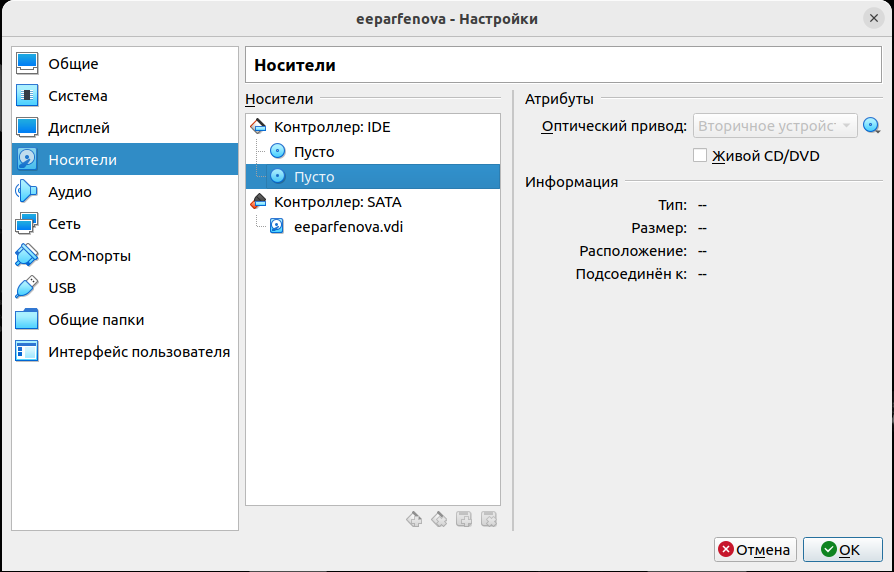

---
## Front matter
lang: ru-RU
title: Лабораторная работа №1
subtitle: Установка и конфигурация операционной системы на виртуальную машину
author:
  - Парфенова Е. Е.
teacher:
  - Кулябов Д. С.
  - д.ф.-м.н., профессор
  - профессор кафедры прикладной информатики и теории вероятностей
institute:
  - Российский университет дружбы народов, Москва, Россия
date: 5 сентября 2024

## i18n babel
babel-lang: russian
babel-otherlangs: english

## Formatting pdf
toc: false
toc-title: Содержание
slide_level: 2
aspectratio: 169
section-titles: true
theme: metropolis
header-includes:
 - \metroset{progressbar=frametitle,sectionpage=progressbar,numbering=fraction}
---

# Информация

## Докладчик

:::::::::::::: {.columns align=center}
::: {.column width="70%"}

  * Парфенова Елизавета Евгеньвена
  * студент
  * Российский университет дружбы народов
  * [1032216437@pfur.ru](mailto:1032216437@pfur.ru)
  * <https://github.com/parfenovaee>

:::
::: {.column width="30%"}

:::
::::::::::::::

# Вводная часть

## Актуальность

- Важность умения устанавливать и правильно настраивать новые операционные системы для возможности беспрепятсвенного выполнения различных задач
- Возможность выполнения последующих лабораторных работ

## Цели и задачи

- Приобрести практические навыки установки операционной системы на виртуальную машину, установив ОС Linux Rocky на виртуальную машину Oracle VirtualBox. Минимально настроить ее для дальнейшей работы сервисов
 - создать репозиторий для дальнейшего выполнения лабораторных работ 
 - настроить git

# Теоретическое введение 

## Теоретичсекое введение(1)

**Виртуальная машина (VM, от англ. virtual machine)** — программная или аппаратная система, эмулирующая аппаратное обеспечение компьютера и исполняющая программы для guest-платформы (guest — гостевая платформа) на host-платформе (host — хост-платформа, платформа-хозяин) или виртуализирующая некоторую платформу и создающая на ней среды, изолирующие друг от друга программы и даже операционные системы

**VirtualBox (Oracle VM VirtualBox)** — программный продукт виртуализации для операционных систем Windows, Linux, FreeBSD, macOS, Solaris/OpenSolaris, ReactOS, DOS и других 

## Теоретичсекое введение(2)

**Linux (в части случаев GNU/Linux)** — семейство Unix-подобных операционных систем на базе ядра Linux, включающих тот или иной набор утилит и программ проекта GNU, и, возможно, другие компоненты. 

**Rocky Linux** — дистрибутив Linux, разработанный Rocky Enterprise Software Foundation. Это полный бинарно-совместимый выпуск, использующий исходный код операционной системы Red Hat Enterprise Linux (RHEL). 

# Выполнение лабораторной работы

## Установка Linux Rocky 

Установка Oracle VirtualBox: *sudo apt-get install virtualbox*

1. 
{#fig:001 width=40%}

## Установка Linux Rocky 

2. Размер основной памяти виртуальной машины

{#fig:002 width=40%}

## Установка Linux Rocky 

3. Конфигурация жесткого диска: загрузочный, VDI, динамический

:::::::::::::: {.columns align=center}
::: {.column width="50%"}

{#fig:003 width=50%}

:::
::: {.column width="50%"}

{#fig:004 width=50%}

:::
::::::::::::::

## Установка Linux Rocky 

:::::::::::::: {.columns align=center}
::: {.column width="50%"}

{#fig:005 width=50%}

:::
::: {.column width="50%"}

4. Размер жесткого диска

{#fig:006 width=50%}

:::
::::::::::::::

## Установка Linux Rocky 

5. Добавление образа операционной системы

{#fig:007 width=40%}

## Настройка Linux Rocky 

1. Устовка языка

{#fig:008 width=40%}

## Настройка Linux Rocky 

2. Отключение KDUMP

{#fig:009 width=40%}

## Настройка Linux Rocky

3. Установка базового окружения и дополнения

{#fig:010 width=40%}

## Настройка Linux Rocky 

:::::::::::::: {.columns align=center}
::: {.column width="50%"}

4. Установка имени пользователя и пароля

{#fig:011 width=50%}

:::
::: {.column width="50%"}

5. Установка пароля для root

{#fig:012 width=50%}

:::
::::::::::::::

## Настройка Linux Rocky 

6. Запуск установки

7. Отключение оптического диска 

{#fig:013 width=40%}

## Настройка Linux Rocky 

:::::::::::::: {.columns align=center}
::: {.column width="50%"}

8. Подключение образа диска дополнительной гостевой ОС

{#fig:014 width=50%}

:::
::: {.column width="50%"}

{#fig:015 width=50%}

:::
::::::::::::::

## Домашнее задание 

Просмотрим вывод команды *dmesg* 

{#fig:016 width=40%}

## Домашнее задание 

Получим следующую информацию с помощью команды *dmesg|grep* с различными параметрами

1. Версия ядра Linux:

{#fig:017 width=40%}

## Домашнее задание 

2. Частота процессора: 

{#fig:018 width=40%}

3. Модель процессора:

{#fig:019 width=40%}

## Домашнее задание 

4. Объем доступной оперативной памяти: 

{#fig:020 width=40%}

## Домашнее задание 

5. Тип обнаруженного гипервизора

{#fig:021 width=40%}

6. Тип файловой системы корневого раздела с помощью команды:

{#fig:022 width=40%}

## Домашнее задание 

7. Последовательность монтирования файловых систем:

{#fig:023 width=40%}

## Настройка git

{#fig:024 width=50%}

## Создание и настройка репозитория курса

1. Создание репозитория 

{#fig:025 width=60%}

## Создание и настройка репозитория курса

2. Заполнение репозитория

{#fig:026 width=60%}

## Создание и настройка репозитория курса

3. Отправка на сервер

{#fig:027 width=60%}

## Настройка конвертирования md-файлов

{#fig:028 width=70%}

# Вывод

## Выводы

-  Мы  приобрели практические навыки установки операционной системы на виртуальную машину и минимально настроили ее для дальнейшей работы сервисов.
 - Мы создали репозиторий для дальнейшего выполнения лабораторных работ и заполнили его необходимыми каталогами
 - Мы убедились в правильности работы git с нашим устройством
 - Мы проверили возможность конвертирования md-файлов в необходимые форматы

