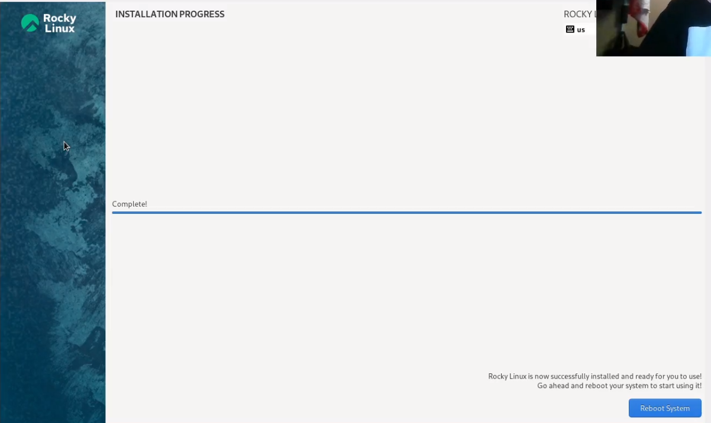

---
## Front matter
title: "Лабораторная работа №1"
subtitle: "Установка и конфигурация операционной системы на виртуальную машину"
author: "Парфенова Елизавета Евгеньевна"

## Generic otions
lang: ru-RU
toc-title: "Содержание"

## Bibliography
bibliography: bib/cite.bib
csl: pandoc/csl/gost-r-7-0-5-2008-numeric.csl

## Pdf output format
toc: true # Table of contents
toc-depth: 2
lof: true # List of figures
lot: true # List of tables
fontsize: 12pt
linestretch: 1.5
papersize: a4
documentclass: scrreprt
## I18n polyglossia
polyglossia-lang:
  name: russian
  options:
	- spelling=modern
	- babelshorthands=true
polyglossia-otherlangs:
  name: english
## I18n babel
babel-lang: russian
babel-otherlangs: english
## Fonts
mainfont: IBM Plex Serif
romanfont: IBM Plex Serif
sansfont: IBM Plex Sans
monofont: IBM Plex Mono
mathfont: STIX Two Math
mainfontoptions: Ligatures=Common,Ligatures=TeX,Scale=0.94
romanfontoptions: Ligatures=Common,Ligatures=TeX,Scale=0.94
sansfontoptions: Ligatures=Common,Ligatures=TeX,Scale=MatchLowercase,Scale=0.94
monofontoptions: Scale=MatchLowercase,Scale=0.94,FakeStretch=0.9
mathfontoptions:
## Biblatex
biblatex: true
biblio-style: "gost-numeric"
biblatexoptions:
  - parentracker=true
  - backend=biber
  - hyperref=auto
  - language=auto
  - autolang=other*
  - citestyle=gost-numeric
## Pandoc-crossref LaTeX customization
figureTitle: "Рис."
tableTitle: "Таблица"
listingTitle: "Листинг"
lofTitle: "Список иллюстраций"
lotTitle: "Список таблиц"
lolTitle: "Листинги"
## Misc options
indent: true
header-includes:
  - \usepackage{indentfirst}
  - \usepackage{float} # keep figures where there are in the text
  - \floatplacement{figure}{H} # keep figures where there are in the text
---

# Цель работы

 - приобретение практических навыков установки операционной системы на виртуальную машину, настройки минимально необходимых для дальнейшей работы сервисов.
 - создание репозитория для дальнейшего выполнения лабораторных работ 
 - настройка git

# Задание

- установить операционную систему Linux Rocky на виртуальную машину Oracle VirtualBox
- создать и настроить репозиторий курса
- настроить git

# Теоретическое введение

**Виртуальная машина (VM, от англ. virtual machine)** — программная или аппаратная система, эмулирующая аппаратное обеспечение компьютера и исполняющая программы для guest-платформы (guest — гостевая платформа) на host-платформе (host — хост-платформа, платформа-хозяин) или виртуализирующая некоторую платформу и создающая на ней среды, изолирующие друг от друга программы и даже операционные системы [@wiki_vb:bash]

**VirtualBox (Oracle VM VirtualBox)** — программный продукт виртуализации для операционных систем Windows, Linux, FreeBSD, macOS, Solaris/OpenSolaris, ReactOS, DOS и других [@vb:bash].

**Linux (в части случаев GNU/Linux)** — семейство Unix-подобных операционных систем на базе ядра Linux, включающих тот или иной набор утилит и программ проекта GNU, и, возможно, другие компоненты [@wiki_linux:bash]. 

**Rocky Linux** — дистрибутив Linux, разработанный Rocky Enterprise Software Foundation. Это полный бинарно-совместимый выпуск, использующий исходный код операционной системы Red Hat Enterprise Linux (RHEL)[@wiki_rocky:bash]. 

# Выполнение лабораторной работы

## Установка Linux Rocky 

Выполнять лабораторные работы будем на операционной сисиеме Linux Ubuntu. Начнем с установки Oracle VirtualBox. Я выполнила это с помощью терминала командой *sudo apt-get install virtualbox*. Устанвока произошла в автоматически определенную виртуальной машиной директорию. 

После успешной установки virtualbox я скачала образ диска с официального сайта Rocky Linux [@linuxrocky:bash] и начала создание новой виртуальной машины. ДЛя этого кликнула кнопку "Создать". Затем заполнила название виртуальной машины в соотсветствии с соглашением об именовании и ее хааркетиристики (Linux, Red Hat 64-bit) в открывшемся окне (рис. [-@fig:001]). 

{#fig:001 width=70%}

Далее я устанавмла размер основной памяти виртуальной машины в 2048
МБ (рис. [-@fig:002]). Задала конфигурацию жёсткого диска — загрузочный (рис. [-@fig:003]), VDI (BirtualBox Disk Image) (рис. [-@fig:004]), динамический виртуальный диск (рис. [-@fig:005]). Задала размер диска в 40 ГБ, его расположение я не изменяла (рис. [-@fig:006]).

{#fig:002 width=70%}

{#fig:003 width=70%}

{#fig:004 width=70%}

{#fig:005 width=70%}

{#fig:006 width=70%}

В настройках VirtualBox я выбрала вкладку "Носители" и в ней добавила новый привод оптических дисков. Там я выбрала образ операционной системы, который скачала ранее (рис. [-@fig:007]). 

{#fig:007 width=70%}

После успешного создания виртуальной машины я приступила к установке операционной системы. В начале я запустила виртуальную машину (рис. [-@fig:008]). 

{#fig:008 width=70%}

Далее я начала настраивать установку ОС. Поставила английский язык (основной) (рис. [-@fig:009]), затем добавила русский в раскладку клавиатуры. Далее отключила KDUMP (рис. [-@fig:010]). Место установки ОС оставила без изменения, как и требовалось. В разделе выбора программ в качестве базового окружения указала Server with GUI , а в качестве дополнения — Development Tools (рис. [-@fig:011]). Затем я установила имя пользователя и пароль (рис. [-@fig:012]), а также пароль для root (рис. [-@fig:013]). Далее во вкладке Networks and Hostname в качестве имени узла указала
eeparfenova.localdomain (рис. [-@fig:014]).  

{#fig:009 width=70%}

{#fig:010 width=70%}

{#fig:011 width=70%}

{#fig:012 width=70%}

{#fig:013 width=70%}

{#fig:014 width=70%}

После успешной установки ОС (рис. [-@fig:015]), я корректно перезапустила виртуальную машину. 

{#fig:015 width=70%}

В VirtualBox оптический диск у меня отключился автоматичсеки (рис. [-@fig:016]).  

{#fig:016 width=70%}

Затем в меню Устройства виртуальной машины я подключила образ диска дополнений госте-
вой ОС. В начале от меня потребовалось установить Virtual Box Guest Additions (рис. [-@fig:017]), а затем произошло подключение (рис. [-@fig:018]). После всего я корректно перезаустила виртуальную машину. 

Имя пользователя и название хоста при установке сделаны в соотвествии с соглашением об именовании.

{#fig:017 width=70%}

{#fig:018 width=70%}

## Домашнее задание

Выполним команду *dmesg* lдля просмотра последовательности загрузки системы(рис. [-@fig:019]). Также просто посмотрим вывод этой команды с помощью *dmesg | less* (рис. [-@fig:020]). Видим, что при загрузке системы последовательно завершилось очень много процессов. 

{#fig:019 width=70%}

{#fig:020 width=70%}

Получим следующую информацию с помощью команды *dmesg|grep* с различными параметрами. 
1. Версия ядра Linux (Linux version) с помощью команды "dmesg|grep 'Linux Version'". Представлена на (рис. [-@fig:021]).

{#fig:021 width=70%}

2. Частота процессора (Detected Mhz processor) с помощью команды "dmesg|grep 'Mhz". Представлена на (рис. [-@fig:022]).

{#fig:022 width=70%}

3. Модель процессора (CPU0) с помощью команды "dmesg|grep 'CPU0'"(рис. [-@fig:023]). Модель процессора моего девайса AMD Ryzen 5.

{#fig:023 width=70%}

4. Объем доступной оперативной памяти (Memory available) с помощью команды "dmesg|grep 'Memory'". Все данные представлены на (рис. [-@fig:024]).

{#fig:024 width=70%}

5. Тип обнаруженного гипервизора (Hypervisor detected) с помощью команды "dmesg|grep 'Hypervisor detected'"(рис. [-@fig:025]). Тип гипервизора: KVM

{#fig:025 width=70%}

6. Тип файловой системы корневого раздела с помощью команды "df -T'"(рис. [-@fig:026]). Это единственная команда, которая вывела корректный результат. Здесь видим, что тип файловой системы корневого раздела - xfs

{#fig:026 width=70%}

7. Последовательность монтирования файловых систем с помощью команды "dmesg|grep 'Mounted'". Она представлена на (рис. [-@fig:027]).

{#fig:027 width=70%}

## Настройка git

На самом деле, так как я работаю на операционной системе, на которой уже выполняла лабораторные работы из прошлых курсов, git был подключене к моему локальному серверу еще полгода назад, на курсе "Математическое моделирование". Была произведена базовая настройка git с заданием имени email и имени пользователя владельца, а также настроены ключи SSH и GPG (рис. [-@fig:028]).

{#fig:028 width=70%}

## Создание и настройка репозитория курса

Мы, как обычно, сделали репозиторий на основе шаблона (рис. [-@fig:029]), я делала это через консоль. В начале я создала необходимый каталог с правильным названием командой *mkdir -p ~/work/study/2024-2025/"Информационная безопасность*, затем перешла в него и создала репозиторий, клонировав шаблон на свой гитхаб:

*gh repo create study_2024-2025_infosec --template=yamadharma/course-directory-student-template --public*

*git clone --recursive git@github.com:parfenovaee/study_2024-2025_infosec.git infosec*

{#fig:029 width=70%}

Далее перешла в каталог курса командой  *cd ~/work/study/2024-2025/"Информационная безопасность"/infosec* и удалила лишние файлы командой *rm package.json*
Создала необходимые каталоги комнадами *echo infosec > COURSE* и *make prepare*. Автоматичсеки репозиторий наполнился каталогами ко всем лабораторным, индивидуальному проекту и презентации. Затем я все загрузила на сервер командами *git add .*, *git commit -am 'feat(main): make course structure'*, *git push*. (рис. [-@fig:030]) (рис. [-@fig:031])

{#fig:030 width=70%}

{#fig:031 width=70%}

Все прошло успешно (рис. [-@fig:032])

{#fig:032 width=70%}

## Настройка конвертирования md-файлов

Так как Pandoc и LaTex уже были установлены на мой компбютер, я просто попробовала конвертировать шаблон отчета к первой лабораторной работе в doc и pdf, а также сконвертировать презентацию из md в pdf и html. Все это выполнеялось командой *make* (рис. [-@fig:033]). 

{#fig:033 width=70%}

В начале возникли небольшие трудности: 

- При конвертации отчета я дополнительно загрузила большое количество шрифтов для корректности выполнения, только тогда все сработало

- для конвертации презентации я использовала немного измененный make-файл, который был на прошлых курсах, с ним ошибок не возникло

# Выводы

-  Мы  приобрели практические навыки установки операционной системы на виртуальную машину и минимально настроили ее для дальнейшей работы сервисов.
 - Мы создали репозиторий для дальнейшего выполнения лабораторных работ и заполнили его необходимыми каталогами
 - Мы убедились в правильности работы git с нашим устройством
 - Мы проверили возможность конвертирования md-файлов в необходимые форматы

# Контрольные вопросы

1. Какую информацию содержит учётная запись пользователя?

Имя пользователя, пароль, UID, полное имя, домашний каталог, оболочка, права доступа и группы.

2. Укажите команды терминала и приведите примеры:

- для получения справки по команде: man <команда>, например *man cd*

- для перемещения по файловой системе: cd <директория>, например *cd ~/work/study/2024-2025/"Информационная безопасность"/infosec*

- для просмотра содержимого каталога: ls, например *ls -l* 
 
- для определения объёма каталога: du -sh <каталог>, например *du -sh /home/user*

- для создания / удаления каталогов / файлов: mkdir <имя_каталога>/ rmdir <имя_каталога> / touch <имя_файла>

- для задания определённых прав на файл / каталог: chmod <права> <файл/каталог>, например *chmod 755 script.sh*

- для просмотра истории команд: history

3. Что такое файловая система? Приведите примеры с краткой характеристикой

Файловая система в Linux — это способ организации и хранения данных на носителе. 

Основные примеры:
- ext4: современная файловая система для Linux, поддерживающая большие объёмы данных и улучшенные функции.

- XFS: высокопроизводительная файловая система, оптимизированная для работы с большими файлами.

- Btrfs: файловая система с поддержкой снимков и встроенной RAID-функциональностью.

4. Как посмотреть, какие файловые системы подмонтированы в ОС?

Использовать команду *df -h* или *"dmesg|grep 'Mounted'"*, как мы сделали это в файле лабы

5. Как удалить зависший процесс?

Командой *kill <идентификатор процесса>*

# Список литературы{.unnumbered}

::: {#refs}
:::
