---
## Front matter
lang: ru-RU
title: Лабораторная работа №4
subtitle: Дискреционное разграничение прав в Linux. Расширенные атрибуты
author:
  - Парфенова Е. Е.
teacher:
  - Кулябов Д. С.
  - д.ф.-м.н., профессор
  - профессор кафедры прикладной информатики и теории вероятностей
institute:
  - Российский университет дружбы народов, Москва, Россия
date: 24 сентября 2024

## i18n babel
babel-lang: russian
babel-otherlangs: english

## Formatting pdf
toc: false
toc-title: Содержание
slide_level: 2
aspectratio: 169
section-titles: true
theme: metropolis
header-includes:
 - \metroset{progressbar=frametitle,sectionpage=progressbar,numbering=fraction}
---

# Информация

## Докладчик

:::::::::::::: {.columns align=center}
::: {.column width="70%"}

  * Парфенова Елизавета Евгеньвена
  * студент
  * Российский университет дружбы народов
  * [1032216437@pfur.ru](mailto:1032216437@pfur.ru)
  * <https://github.com/parfenovaee>

:::
::: {.column width="30%"}

:::
::::::::::::::

# Вводная часть

## Актуальность

Важность знания расширенных атрибутов файлов для дальнейшей корректной работы с ОС Linux, а также умения практически применять эти знания

## Цели и задачи

**Цель**: Получение практических навыков работы в консоли с расширенными атрибутами файлов

**Задачи**: 

- практическое применение команды chattr для изменения расширенных атрибутов файлов 
- использование раширенных атрибутов a и i и проверка возможности выполнения различных операций

# Теоретическое введение 

## Теоретичсекое введение(1)

**Права доступа** в операционной системе Linux представляют собой ключевой элемент безопасности, определяющий, какой доступ имеют пользователи и программы к файлам и каталогам.

**Расширенные атрибуты файловых объектов** - поддерживаемая некоторыми файловыми системами возможность ассоциировать с файловыми объектами произвольные метаданные. 

## Теоретичсекое введение(2)

Команда *chattr* изменяет атрибуты файлов в файловой системе Linux. Оператор «+» вызывает добавление выбранных атрибутов к существующим атрибутам файлов, «—» заставляет их удалить и «=» делает их единственными атрибутами файлов.

Полня команда может выглядеть следующим образом: *chattr +a 'файлы'*

Команда *lsattr* перечисляет атрибуты файлов в файловой системе Linux. Например, *lsstar 'файлы'*, позволит просмотреть расширенные атрибуты, которые имеет определенный файл

## Теоретичсекое введение(3)

Подробне рассмотрим ращиренные атрибуты, которые мы будем использовать в лабораторной работе: 

- Файл с установленным атрибутом «a» можно открыть только в режиме добавления для записи. Только суперпользователь может установить или очистить этот атрибут.

- Файл с атрибутом «i» не может быть изменён: его нельзя удалить или переименовать, нельзя создать ссылку на этот файл, большую часть метаданных файла нельзя изменить, и файл нельзя открыть в режиме записи. 

Только суперпользователь может установить или очистить эти атрибут.

# Выполнение лабораторной работы

## Атрибуты file1

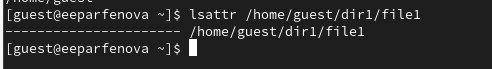{#fig:001 width=40%}

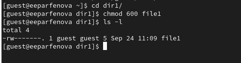{#fig:002 width=40%}

## Установка раширенного атрибута

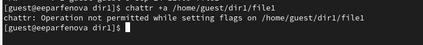{#fig:003 width=50%}

## Установка раширенного атрибута

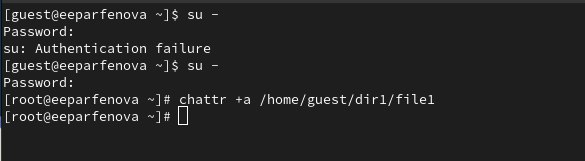{#fig:004 width=40%}

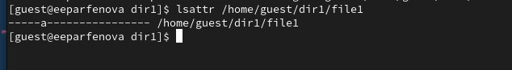{#fig:005 width=40%}

## Выполнение команд для файла с атрибутом a

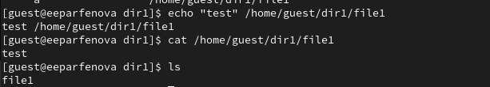{#fig:006 width=50%}

## Выполнение команд для файла с атрибутом a

**Вывод**: только дозапись и чтение выполнены успешно

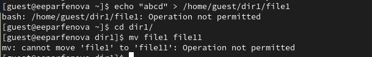{#fig:007 width=30%}

{#fig:008 width=30%}

## Выполнение команд для файла без раширенных атрибутов

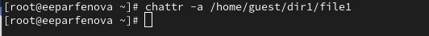{#fig:009 width=50%}

## Выполнение команд для файла без раширенных атрибутов

**Вывод**: возможно выполнить все перечисленные операции

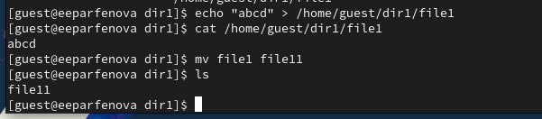{#fig:010 width=30%}

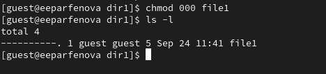{#fig:011 width=30%}

## Выполнение команд для файла с атрибутом i

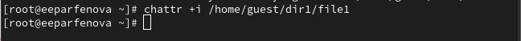{#fig:012 width=40%}

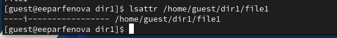{#fig:013 width=40%}

## Выполнение команд для файла с атрибутом i

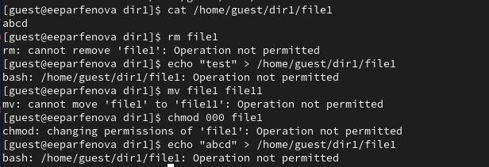{#fig:014 width=50%}

## Выполнение команд для файла с атрибутом i

**Вывод**: Не доступна ни одна операция, даже дозапись в файл

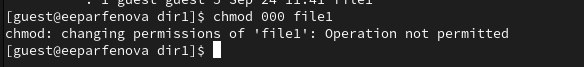{#fig:015 width=50%}

# Вывод

## Выводы

Мы получили практические навыки работы в консоли с расширенными атрибутами файлов, практическое примененив команду chattr для их изменения. Также выполнили различные операции для файла с атрибуами a и i. 