---
## Front matter
title: "Лабораторная работа №4"
subtitle: "Дискреционное разграничение прав в Linux. Расширенные атрибуты"
author: "Парфенова Елизавета Евгеньевна"

## Generic otions
lang: ru-RU
toc-title: "Содержание"

## Bibliography
bibliography: bib/cite.bib
csl: pandoc/csl/gost-r-7-0-5-2008-numeric.csl

## Pdf output format
toc: true # Table of contents
toc-depth: 2
lof: true # List of figures
lot: true # List of tables
fontsize: 12pt
linestretch: 1.5
papersize: a4
documentclass: scrreprt
## I18n polyglossia
polyglossia-lang:
  name: russian
  options:
	- spelling=modern
	- babelshorthands=true
polyglossia-otherlangs:
  name: english
## I18n babel
babel-lang: russian
babel-otherlangs: english
## Fonts
mainfont: IBM Plex Serif
romanfont: IBM Plex Serif
sansfont: IBM Plex Sans
monofont: IBM Plex Mono
mathfont: STIX Two Math
mainfontoptions: Ligatures=Common,Ligatures=TeX,Scale=0.94
romanfontoptions: Ligatures=Common,Ligatures=TeX,Scale=0.94
sansfontoptions: Ligatures=Common,Ligatures=TeX,Scale=MatchLowercase,Scale=0.94
monofontoptions: Scale=MatchLowercase,Scale=0.94,FakeStretch=0.9
mathfontoptions:
## Biblatex
biblatex: true
biblio-style: "gost-numeric"
biblatexoptions:
  - parentracker=true
  - backend=biber
  - hyperref=auto
  - language=auto
  - autolang=other*
  - citestyle=gost-numeric
## Pandoc-crossref LaTeX customization
figureTitle: "Рис."
tableTitle: "Таблица"
listingTitle: "Листинг"
lofTitle: "Список иллюстраций"
lotTitle: "Список таблиц"
lolTitle: "Листинги"
## Misc options
indent: true
header-includes:
  - \usepackage{indentfirst}
  - \usepackage{float} # keep figures where there are in the text
  - \floatplacement{figure}{H} # keep figures where there are in the text
---

# Цель работы

Получение практических навыков работы в консоли с расширенными атрибутами файлов

# Теоретическое введение

Права доступа в операционной системе Linux представляют собой ключевой элемент безопасности, определяющий, какой доступ имеют пользователи и программы к файлам и каталогам. [@prav:bash]

Расширенные атрибуты файловых объектов - поддерживаемая некоторыми файловыми системами возможность ассоциировать с файловыми объектами произвольные метаданные. [@oprattr:bash]

Команда *chattr* изменяет атрибуты файлов в файловой системе Linux. Оператор «+» вызывает добавление выбранных атрибутов к существующим атрибутам файлов; «—» заставляет их удалить; и «=» делает их единственными атрибутами файлов.

Полня команда может выглядеть следующим образом: *chattr +a <файлы>*

Команда *lsattr* перечисляет атрибуты файлов в файловой системе Linux. Например, *lsstar <файлы>*, позволит просмотреть расширенные атрибуты, которые имеет определенный файл

Буквы **«aAcCdDeFijmPsStTux»** выбирают новые атрибуты для файлов:

- только добавление (a),
- без обновлений времени (A),
- сжатие (c),
- без копирования при записи (C),
- без дампа (d),
- синхронные обновления каталогов (D),
- формат экстента (e),
- поиск в каталогах без учёта регистра (F),
- неизменяемый (i),
- ведение журнала данных (j),
- без сжатия (m),
- иерархия проекта (P),
- безопасное удаление (s),
- синхронные обновления (S),
- без слияния хвостов (t),
- вершина иерархии каталогов (T),
- возможность восстановления после удаления (u)
- прямой доступ к файлам (x).

Следующие атрибуты доступны только для чтения и могут быть перечислены lsattr, но не могут быть изменены chattr:

- зашифрованный (E),
- индексированный каталог (I),
- встроенные данные (N)
- достоверность (V).

Подробне рассмотрим ращиренные атрибуты, которые мы будем использовать в лабораторной работе: 

- Файл с установленным атрибутом «a» можно открыть только в режиме добавления для записи. Только суперпользователь или процесс, обладающий возможностью CAP_LINUX_IMMUTABLE, может установить или очистить этот атрибут.

- Файл с атрибутом «i» не может быть изменён: его нельзя удалить или переименовать, нельзя создать ссылку на этот файл, большую часть метаданных файла нельзя изменить, и файл нельзя открыть в режиме записи. Только суперпользователь или процесс, обладающий возможностью CAP_LINUX_IMMUTABLE, может установить или очистить этот атрибут. [@attr:bash]

# Выполнение лабораторной работы

От имени пользователя guest определим расширенные атрибуты файла /home/guest/dir1/file1 командой *lsattr /home/guest/dir1/file1*.(рис. [-@fig:001]) Видим, что файл не имеет никаких раширенных атрибутов 

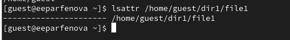{#fig:001 width=70%}

Установим командой *chmod 600 file1* на файл file1 права, разрешающие чтение и запись для владельца файла. Проверим, что права действительно были установлены (рис. [-@fig:002])

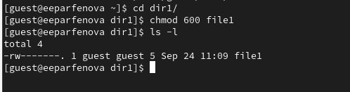{#fig:002 width=70%}

Попробуем установить на файл /home/guest/dir1/file1 расширенный атрибут a от имени пользователя guest командой *chattr +a /home/guest/dir1/file1*. Видим, что мы не смогли это сделать и получили отказ от выполнения операции (рис. [-@fig:003])

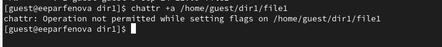{#fig:003 width=70%}

Откроем второе окно терминала и, войдя с правами суперпользователя, попробуем ввести ту же команду и установить на файл ращиренный атрибут a (рис. [-@fig:004]). Проверим, что все успешно получилось от имени пользовтаеля guest командой *lsattr /home/guest/dir1/file1*. (рис. [-@fig:005]) 

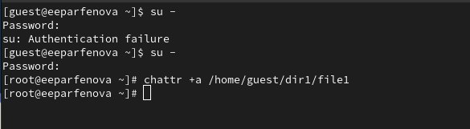{#fig:004 width=70%}

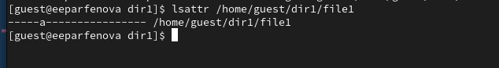{#fig:005 width=70%}

Выполним дозапись в файл file1 слова «test» командой *echo "test" /home/guest/dir1/file1*. После этого выполним чтение файла file1 командой *cat /home/guest/dir1/file1*, убеждаясь, что слово test было успешно записано в file1. (рис. [-@fig:006])

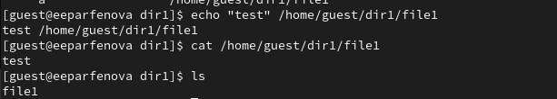{#fig:006 width=70%}

Попробуем стереть имеющуюся в файле информацию командой *echo "abcd" > /home/guest/dirl/file1*. Видим, что нам отказано в операции.  Попробуем переименовать файл, что также не получается. (рис. [-@fig:007]) Далее попробуем установить на файл file1 права, например, запрещающие чтение и запись для владельца файла командой *chmod 000 file1*, однако снова получаем отказ от выполнения операции. (рис. [-@fig:008])

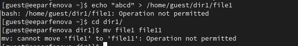{#fig:007 width=70%}

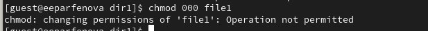{#fig:008 width=70%}

Снимем раширенный атрибут a с file1 от имени суперпользователя (рис. [-@fig:009]) и попробуем выполнить те же операции. Видим, что каждая операция выполнена успешно. (рис. [-@fig:010]) (рис. [-@fig:011])

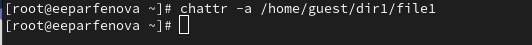{#fig:009 width=70%}

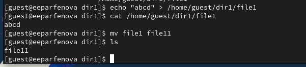{#fig:010 width=70%}

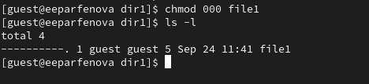{#fig:011 width=70%}

Далее проделаем те же самые действия, установив на файл атрибут i. Сделаем это командой *chattr +i /home/guest/dir1/file1* от имени суперпользователя (рис. [-@fig:012]) и проверим от имени пользователя guest, все ли получилось (рис. [-@fig:013]). 

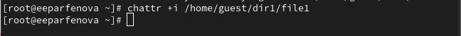{#fig:012 width=70%}

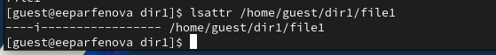{#fig:013 width=70%}

Проверим выполнение всех команд, опробованных выше, на файле с новым атрибутом. Видим, что тперь даже дозапись в файл нам недоступна, что логично, ведь атрибут i делает файл полностью неизменяемым для владельца. (рис. [-@fig:014]) (рис. [-@fig:015])

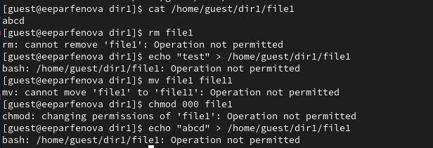{#fig:014 width=70%}

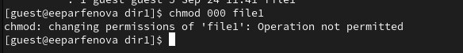{#fig:015 width=70%}

# Выводы

Мы получили практические навыки работы в консоли с расширенными атрибутами файлов

# Список литературы{.unnumbered}

::: {#refs}
:::
