---
## Front matter
lang: ru-RU
title: Лабораторная работа №5
subtitle: Дискреционное разграничение прав в Linux. Исследование влияния дополнительных атрибутов
author:
  - Парфенова Е. Е.
teacher:
  - Кулябов Д. С.
  - д.ф.-м.н., профессор
  - профессор кафедры прикладной информатики и теории вероятностей
institute:
  - Российский университет дружбы народов, Москва, Россия
date: 1 октября 2024

## i18n babel
babel-lang: russian
babel-otherlangs: english

## Formatting pdf
toc: false
toc-title: Содержание
slide_level: 2
aspectratio: 169
section-titles: true
theme: metropolis
header-includes:
 - \metroset{progressbar=frametitle,sectionpage=progressbar,numbering=fraction}
---

# Информация

## Докладчик

:::::::::::::: {.columns align=center}
::: {.column width="70%"}

  * Парфенова Елизавета Евгеньвена
  * студент
  * Российский университет дружбы народов
  * [1032216437@pfur.ru](mailto:1032216437@pfur.ru)
  * <https://github.com/parfenovaee>

:::
::: {.column width="30%"}

:::
::::::::::::::

# Вводная часть

## Актуальность

Важность знания дополнительных атрибутов и их назначения в операционной системе Linux для эффективной и беспроблемной работы с директориями и файлами

## Цели и задачи

**Цель**: Изучение механизмов изменения идентификаторов, применения SetUID- и Sticky-битов. Получение практических навыков работы в консоли с дополнительными атрибутами. Рассмотрение работы механизма смены идентификатора процессов пользователей, а также влияние бита Sticky на запись и удаление файлов.

**Задачи**: 

- Изменение идентификаторов и применение SetUID-, SetGID- и Sticky-битов.
- Проверка выполнение различных операций при разных дополнительных атрибутах

# Теоретическое введение 

## Теоретичсекое введение(1)

Кроме прав чтения, выполнения и записи, есть еще три дополнительных атрибута.

1. SetUID – это бит разрешения, который позволяет пользователю запускать исполняемый файл с правами владельца этого файла. Другими словами, использование этого бита позволяет нам поднять привилегии пользователя в случае, если это необходимо. Например, права "-rw**s**r-xr-x": на месте, где обычно установлен классический бит x (на исполнение), у нас выставлен специальный бит s. Командна, с помощью которой устанавливается этот доп.атрибут: *chmod u+s 'filename'*

## Теоретичсекое введение(2)

2. SetGID - это бит разрешения, который позволяет пользователю запускать исполняемый файл от имени группы, которая владеет файлом. Например, права "-rwxr-**s**r-x": на месте, где обычно установлен классический бит x (на исполнение группой), у нас выставлен специальный бит s. Командна, с помощью которой устанавливается этот доп.атрибут: *chmod g+s 'filename'*

## Теоретичсекое введение(3)

3. Sticky Bit - специальный бит разрешения, который позволяет только владельцу удалять файлы в папке, на которой этот бит установлен. Пример использования этого бита в операционной системе это системная папка /tmp . Эта папка разрешена на запись любому пользователю, но удалять файлы в ней могут только пользователи, являющиеся владельцами этих файлов.

# Выполнение лабораторной работы

## Подготовка лабораторного стенда 

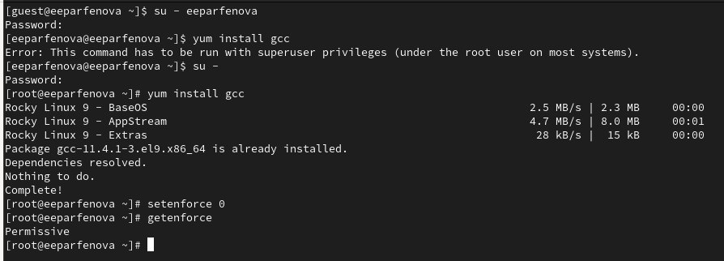{#fig:001 width=70%}

## Программа simpleid.c

{#fig:002 width=70%}

## Сравнение simpleid и id

**Вывод**: вывод на экран при выполнении обеих команд совпадает

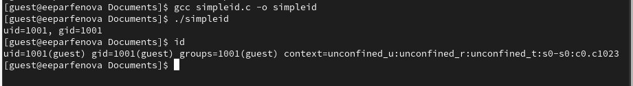{#fig:003 width=50%}

## Программа simpleid2.c

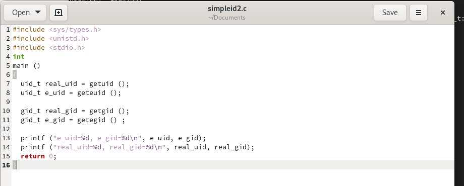{#fig:004 width=70%}

## Выполнение simpleid2

**Вывод**: совпадает с данными в предыдущих случаях

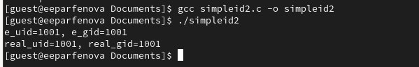{#fig:005 width=50%}

## SetUID - бит

**Вывод**: результаты вывода программы и команды для суперпользователя одинаковы 

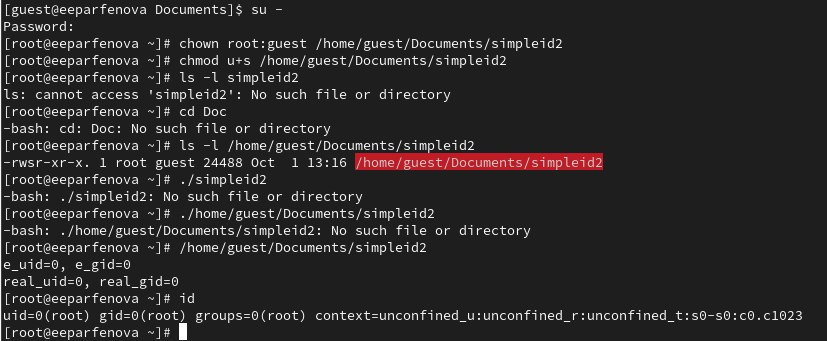{#fig:006 width=50%}

## SetGID-бит

**Вывод**: результаты снова одинаковы 

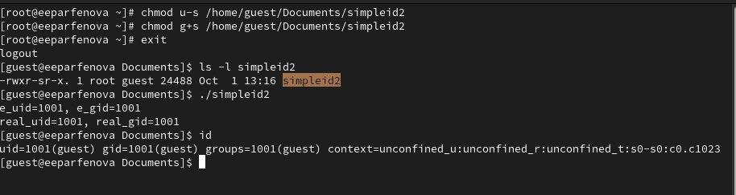{#fig:007 width=70%}

## Программа readfile.c

:::::::::::::: {.columns align=center}
::: {.column width="50%"}

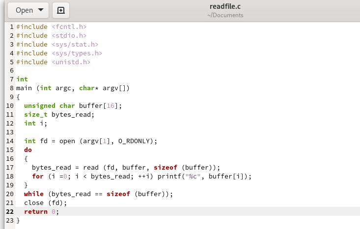{#fig:008 width=70%}

:::
::: {.column width="50%"}

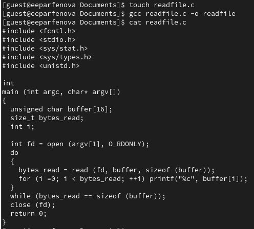{#fig:009 width=70%}

:::
::::::::::::::

## Изменение владельца и прав readfile.c

:::::::::::::: {.columns align=center}
::: {.column width="50%"}

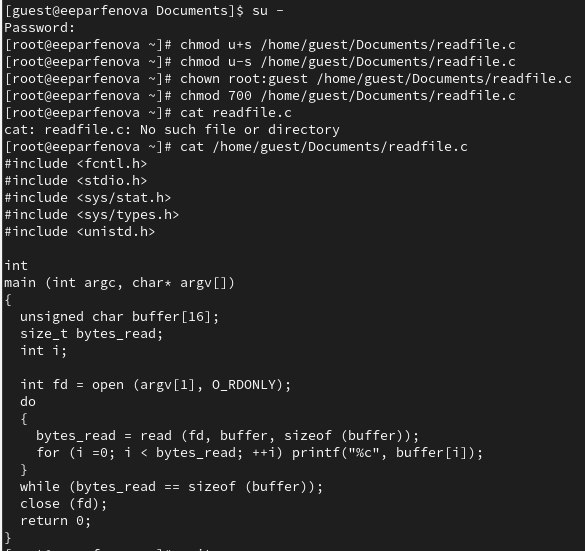{#fig:010 width=70%}

:::
::: {.column width="50%"}

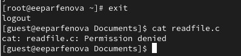{#fig:011 width=70%}

:::
::::::::::::::

## Права и доп.атрибуты программы  readfile

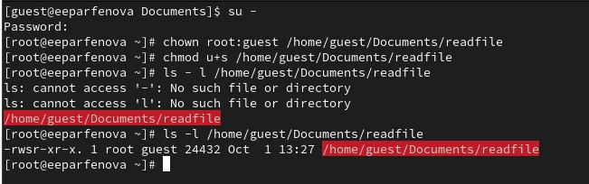{#fig:012 width=70%}

## Чтение с помощью программы readfile

**Вывод** : readfile имеет все права пользователя root

:::::::::::::: {.columns align=center}
::: {.column width="50%"}

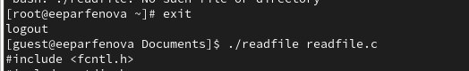{#fig:013 width=70%}

:::
::: {.column width="50%"}

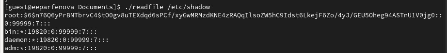{#fig:014 width=70%}

:::
::::::::::::::

##  Исследование Sticky-бита

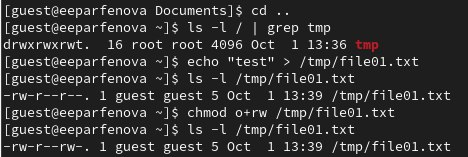{#fig:015 width=70%}

##  Исследование Sticky-бита

**Вывод** : ни одна из операций кроме чтения недоступна

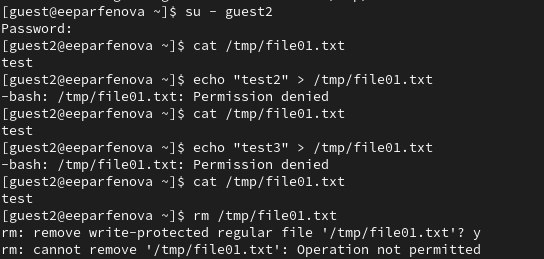{#fig:016 width=50%}

##  Исследование Sticky-бита

**Вывод** : стало доступно удаление файла

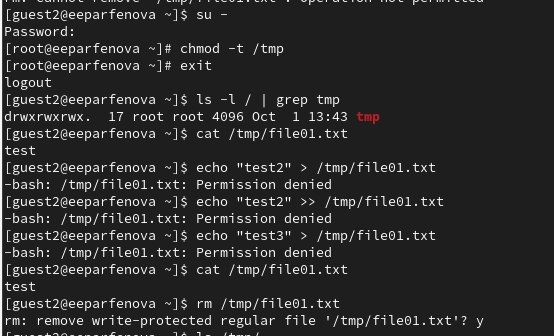{#fig:017 width=50%}

##  Исследование Sticky-бита

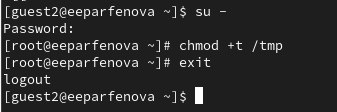{#fig:018 width=70%}

# Вывод

## Выводы

В результате выполнения лабораторной работы мы:

- изучили механизм изменения идентификаторов, применения SetUID-, SetGID- и Sticky-битов

- получили практические навыки работы в консоли с дополнительными атрибутами

- рассмотрели работу механизма смены идентификатора процессов пользователей, а также влияние бита Sticky на запись и удаление файлов

