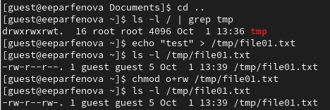

---
## Front matter
title: "Лабораторная работа №5"
subtitle: "Дискреционное разграничение прав в Linux. Исследование влияния дополнительных атрибутов"
author: "Парфенова Елизавета Евгеньевна"

## Generic otions
lang: ru-RU
toc-title: "Содержание"

## Bibliography
bibliography: bib/cite.bib
csl: pandoc/csl/gost-r-7-0-5-2008-numeric.csl

## Pdf output format
toc: true # Table of contents
toc-depth: 2
lof: true # List of figures
lot: true # List of tables
fontsize: 12pt
linestretch: 1.5
papersize: a4
documentclass: scrreprt
## I18n polyglossia
polyglossia-lang:
  name: russian
  options:
	- spelling=modern
	- babelshorthands=true
polyglossia-otherlangs:
  name: english
## I18n babel
babel-lang: russian
babel-otherlangs: english
## Fonts
mainfont: IBM Plex Serif
romanfont: IBM Plex Serif
sansfont: IBM Plex Sans
monofont: IBM Plex Mono
mathfont: STIX Two Math
mainfontoptions: Ligatures=Common,Ligatures=TeX,Scale=0.94
romanfontoptions: Ligatures=Common,Ligatures=TeX,Scale=0.94
sansfontoptions: Ligatures=Common,Ligatures=TeX,Scale=MatchLowercase,Scale=0.94
monofontoptions: Scale=MatchLowercase,Scale=0.94,FakeStretch=0.9
mathfontoptions:
## Biblatex
biblatex: true
biblio-style: "gost-numeric"
biblatexoptions:
  - parentracker=true
  - backend=biber
  - hyperref=auto
  - language=auto
  - autolang=other*
  - citestyle=gost-numeric
## Pandoc-crossref LaTeX customization
figureTitle: "Рис."
tableTitle: "Таблица"
listingTitle: "Листинг"
lofTitle: "Список иллюстраций"
lotTitle: "Список таблиц"
lolTitle: "Листинги"
## Misc options
indent: true
header-includes:
  - \usepackage{indentfirst}
  - \usepackage{float} # keep figures where there are in the text
  - \floatplacement{figure}{H} # keep figures where there are in the text
---

# Цель работы

Изучение механизмов изменения идентификаторов, применения SetUID- и Sticky-битов. Получение практических навыков работы в консоли с дополнительными атрибутами. Рассмотрение работы механизма смены идентификатора процессов пользователей, а также влияние бита Sticky на запись и удаление файлов.

# Теоретическое введение

Права доступа в операционной системе Linux представляют собой ключевой элемент безопасности, определяющий, какой доступ имеют пользователи и программы к файлам и каталогам [@prav:bash]. 

Есть 3 вида разрешений. Они определяют права пользователя на 3 действия: чтение, запись и выполнение. В Linux эти действия обозначаются вот так:

- r — read (чтение) — право просматривать содержимое файла;
- w — write (запись) — право изменять содержимое файла;
- x — execute (выполнение) — право запускать файл, если это программа или скрипт.

У каждого файла есть 3 группы пользователей, для которых можно устанавливать права доступа. 

- owner (владелец) — отдельный человек, который владеет файлом. Обычно это тот, кто создал файл, но владельцем можно сделать и кого-то другого.
- group (группа) — пользователи с общими заданными правами.
- others (другие) — все остальные пользователи, не относящиеся к группе и не являющиеся владельцами [@group:bash]. 

Но, кроме прав чтения, выполнения и записи, есть еще три дополнительных атрибута.

1. SetUID – это бит разрешения, который позволяет пользователю запускать исполняемый файл с правами владельца этого файла. Другими словами, использование этого бита позволяет нам поднять привилегии пользователя в случае, если это необходимо. Например, права "-rw**s**r-xr-x": на месте, где обычно установлен классический бит x (на исполнение), у нас выставлен специальный бит s. Командна, с помощью которой устанавливается этот доп.атрибут: *chmod u+s 'filename'*

2. SetGID - это бит разрешения, который позволяет пользователю запускать исполняемый файл от имени группы, которая владеет файлом. Например, права "-rwxr-**s**r-x": на месте, где обычно установлен классический бит x (на исполнение группой), у нас выставлен специальный бит s. Командна, с помощью которой устанавливается этот доп.атрибут: *chmod g+s 'filename'*

3. Sticky Bit - специальный бит разрешения, который позволяет только владельцу удалять файлы в папке, на которой этот бит установлен. Пример использования этого бита в операционной системе это системная папка /tmp . Эта папка разрешена на запись любому пользователю, но удалять файлы в ней могут только пользователи, являющиеся владельцами этих файлов. [@dop_at:bash]

# Выполнение лабораторной работы

## Подготовка лабораторного стенда

Начнем с подготовки лабораторного стенда. Ппроверим установку gcc в нашей ОС, а так же отключим систему запретов SELinux командой *setenforce 0*. После этого проверим, чтобы команда *getenforce* выводила Permissive. Это свидетельствует о том, что все получилось парвильно. (рис. [-@fig:001]).

{#fig:001 width=70%}

## Создание программ и работа с SetUID- и SetGID-битами

Далее войдем в систему от пользователя guest и создадим файл simpleid.c командой *touch*. (рис. [-@fig:002])

{#fig:002 width=70%}

Запишем в файл программу, представленную в файле лабораторной работы, которая выводит на экран uid и gid пользователя (рис. [-@fig:003])

{#fig:003 width=70%}

Далее скомплилируем программу командой *gcc simpleid.c -o simpleid* (проверяем, что программа появилась в каталоге) и выполним ее с помощью *./simpleid*. Видим, что выводятся uid и gid. Выполним команду *id* и сравним результаты. (рис. [-@fig:004])Видим, что вывод обеих команд совпадает (uid и gid равны 1001)

{#fig:004 width=70%}

Создадим файл simpleid2.c и запишем в него усложненную программу, в которой добавлен вывод действительных идентификаторов. (рис. [-@fig:005])

{#fig:005 width=70%}

Скомпилируем и запустим simpleid2.c командами *gcc simpleid2.c -o simpleid2* и *./simpleid2* соотвественно. (рис. [-@fig:006]). Видим, что вывод этой программы, предыдцщей и команды id полностью совпадают.

{#fig:006 width=70%}

От имени суперпользователя (временно повысив свои права с помощью su) выполним команды *chown root:guest /home/guest/simpleid2* и *chmod u+s /home/guest/simpleid2*, чтобы сменить владельца файла simpleid2 и установить дополнительный атрибут SetUID-бит соотвественно. Выполним проверку правильности установки новых атрибутов и смены владельца файла simpleid2 командой *ls -l simpleid2*. Видим, что на месте x в правах владельца в необходимом месте появилас s. Запустим simpleid2 и id командами *./simpleid2* и *id*. Видим, что результаты вывода программы и команды одинаковы для суперпользователя (все параметры равны 0)(рис. [-@fig:007])

{#fig:007 width=70%}

Проделаем тоже самое относительно SetGID-бита. Для этого командой *chmod u-s /home/guest/simpleid2* снимем предыдущий дополнительный атрибут и установим SetGID-бита с помощью *chmod g+s /home/guest/simpleid2*. Все манипуляции выполняем от имени суперпользователя. Затем выйдем из этого режима, и от имени пользователя guest запустим программу simpleid2.c и команду *id*. Все проходит успешно, и при сравнении результатов снова видим, что выводы одинаковы (рис. [-@fig:008])

{#fig:008 width=70%}

Создадим файл readfile.c, запишем в него программу для чтения файлов(рис. [-@fig:009]) и откомпилируем ее командой *gcc readfile.c -o readfile* (рис. [-@fig:010]) и попробуем прочитать командой *cat readfile.c*. Видим, что все проходит успешно. 

{#fig:009 width=70%}

{#fig:010 width=70%}

Сменим владельца у файла readfile.c командой *chown root:guest /home/guest/readfile.c* (предварительно повысив свои права до суперпользователя) и изменим права так, чтобы только суперпользователь (root) мог прочитать его, a guest не мог. Сделаем это с помощью команды *chmod 700 /home/guest/readfile.c*. Суперпользователь может прочесть файл (команда *cat*) (рис. [-@fig:011]) 

{#fig:011 width=70%}

Проверим, что пользователь guest не может прочитать файл readfile.c. Для этого выйдем из режима суперпользователя и примерим команду *cat readfile.c* от имени пользователя guest. В доступе нам отказано. (рис. [-@fig:012]) 

{#fig:012 width=70%}

Сменим у программы readfile владельца и установите SetUID-бит. Для этого в режиме суперпользователя применим команды *chown root:guest /home/guest/readfile* и *chmod u+s /home/guest/readfile* соответсвенно для каждой задачи. Проверим, что все прошло успешно командой *ls -l*. (рис. [-@fig:013]) 

{#fig:013 width=70%}

Проверим, может ли программа readfile прочитать файл readfile.c командой *./readfile readfile.c*, предварительно выйдя из режим суперпользователя. Видим, что все получается. (рис. [-@fig:014]) 

{#fig:014 width=70%}

Теперь проверим, может ли программа readfile прочитать файл /etc/shadow, используя 
*./readfile /etc/shadow*. (рис. [-@fig:015])  Видим, что файл также успешно читается, несмотря на то, что guest не является его владельцем. Это происходит потому, что программа readfile теперь имеет все права пользователя root. 

{#fig:015 width=70%}

## Исследование Sticky-бита

Выясним, установлен ли атрибут Sticky на директории /tmp, выполнив команду 
*ls -l / | grep tmp*. Видим, что в конце есть атрибут t, что свидетельствует об атрибуте Sticky. Далее от имени пользователя guest создадим файл file01.txt в директории /tmp со словом test следующей командой *echo "test" > /tmp/file01.txt*. Посмотрим атрибуты созданного файла с помощью *ls -l /tmp/file01.txt*. Видим, что в данный момент категории "все остальные" доступно только чтение, поэтому командой *chmod o+rw /tmp/file01.txt* разрешим им чтение и запись. Проверим, что все получилось корректно. (рис. [-@fig:016]) 

{#fig:016 width=70%}

От имени пользователя guest2 (не являющегося владельцем) попробуем про-
читать файл /tmp/file01.txt командой *cat /tmp/file01.txt*. Видим, что в нем записано слово "test". Далее попробуем дозаписать в файл слово "test2" командой
*echo "test2" > /tmp/file01.txt*, но в операции нам отказано. Проверим содержимое файла, видим, что ничего не изменилось. Затем попробуем записать в файл /tmp/file01. txt слово "test3", стерев при этом всю имеющуюся в файле информацию ко-
мандой *echo "test3" > /tmp/file01.txt*, однако операция также не выполняется. Проверям содержимое файла, чтобы в этом убедиться. В конце концов, попробцем удалить файл командой *rm /tmp/fileOl.txt*, но и в этом нам отказано. (рис. [-@fig:017]) 

{#fig:017 width=70%}

Попроубем снять атрибут t c директории /tmp командой *chmod -t /tmp*, предваритель новысив свои права до суперпользователя командой *su -*. Покинем режим суперпользовтаеля и проверим правильность выполнения предыдущей команды с помощью *ls -l / | grep tmp*. Видим, что атрибут t в конце пропал. Проделаем все манипуляции с file01.txt, описанные выше, без атрибута t на директории /tmp, и увидим, что мы все также можем прочитать файл, дозапись и перезапись опять недоступны. Однако удаление файла из этой директории стало возможным. Это объясняется снятием атрибута Sticky-бит, так как он запрещал не владельцу директории удалять файлы из нее, а вот на создание и чтение запретов не накладывал. (рис. [-@fig:018]) 

{#fig:018 width=70%}

Теперь снова повысим свои права до суперпользователя и вернем атрибут t на ди-
ректорию /tmp для будущей ее безопасности. (рис. [-@fig:019]) 

{#fig:019 width=70%}

# Выводы

Мы изучили механизм изменения идентификаторов, применения SetUID-, SetGID- и Sticky-битов. Также получили практические навыки работы в консоли с дополнительными атрибутами и рассмотрели работу механизма смены идентификатора процессов пользователей, а также влияние бита Sticky на запись и удаление файлов.

# Список литературы{.unnumbered}

::: {#refs}
:::
