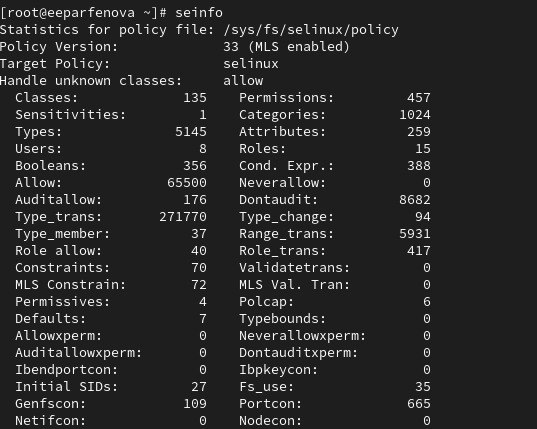
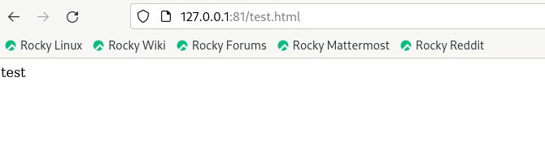

---
## Front matter
lang: ru-RU
title: Лабораторная работа №6
subtitle: Мандатное разграничение прав в Linux
author:
  - Парфенова Е. Е.
teacher:
  - Кулябов Д. С.
  - д.ф.-м.н., профессор
  - профессор кафедры прикладной информатики и теории вероятностей
institute:
  - Российский университет дружбы народов, Москва, Россия
date: 12 октября 2024

## i18n babel
babel-lang: russian
babel-otherlangs: english

## Formatting pdf
toc: false
toc-title: Содержание
slide_level: 2
aspectratio: 169
section-titles: true
theme: metropolis
header-includes:
 - \metroset{progressbar=frametitle,sectionpage=progressbar,numbering=fraction}
---

# Информация

## Докладчик

:::::::::::::: {.columns align=center}
::: {.column width="70%"}

  * Парфенова Елизавета Евгеньвена
  * студент
  * Российский университет дружбы народов
  * [1032216437@pfur.ru](mailto:1032216437@pfur.ru)
  * <https://github.com/parfenovaee>

:::
::: {.column width="30%"}


:::
::::::::::::::

# Вводная часть

## Актуальность

Важность понимания работы технологии SELinux для эффективной работы с ОС Linux и обеспечения директориям и файлам должной безопасности


## Цели и задачи

**Цель**: Развить навыки администрирования ОС Linux. Получить первое практическое знакомство с технологией SELinux

**Задача**: Проверить работу SELinx на практике совместно с веб-сервером Apache.

# Теоретическое введение 

## Теоретичсекое введение(1)

**SELinux**  — это система принудительного контроля доступа, реализованная на уровне ядра, которая применяется только в том случае, если проверка классической системой прав Unix будет успешно пройдена.

## Теоретичсекое введение(2)

Основные термины, использующиеся в SELinux:

- *Домен* — список действий, которые может выполнять процесс.

- *Роль* — список доменов, которые могут быть применены. 

- *Тип* — набор действий, которые допустимы по отношения к объекту.

- *Контекст безопасности* — все атрибуты SELinux — роли, типы и домены. 

## Теоретичсекое введение(3)

SELinux имеет три основных режим работы, при этом по умолчанию установлен режим Enforcing. Режимы работы SELinux:

1. Enforcing

2. Permissive

3. Disabled

# Выполнение лабораторной работы

## Подготовка лабораторного стенда

{#fig:001 width=70%}

## Просмотр редима и политики SELinux

{#fig:002 width=70%}

## Запуск и проверка работы сервера Apache

{#fig:003 width=70%}

## Контекст безопасности сервера Apache

Контекст безопасности сервера Apache: system_u:system_r:httpd_t:s0

{#fig:004 width=60%}

## Переключатели SELinux для Apache

{#fig:005 width=20%}


## Статистика по политике

{#fig:006 width=50%}


## Множество пользователей, ролей, типов


:::::::::::::: {.columns align=center}
::: {.column width="30%"}
- Users - 8
- Roles - 15
- Types - 5145

:::
::: {.column width="70%"}


{#fig:007 width=40%}

:::
::::::::::::::


## Файлы и поддиректори в /var/www

{#fig:008 width=70%}


## Файл test.html

:::::::::::::: {.columns align=center}
::: {.column width="40%"}

```
<html>
<body>test</body>
</html>
```

:::
::: {.column width="60%"}


{#fig:009 width=70%}

:::
::::::::::::::


## Файл test.html

{#fig:010 width=70%}

## Файл test.html

{#fig:011 width=70%}

## Файл test.html

{#fig:012 width=70%}

## Лог-файлы

:::::::::::::: {.columns align=center}
::: {.column width="50%"}

{#fig:013 width=80%}

:::
::: {.column width="50%"}

{#fig:014 width=80%}

:::
::::::::::::::

## Замена порта 

{#fig:015 width=70%}

## Сбой сервера при запуске с 81 порта

{#fig:016 width=50%}

## Лог-файл

**Вывод**: Появилась новая запись в лог-файла ошибок о невозможности загрузки, и не появилось новой записи в лог-файле доступа.

{#fig:017 width=50%}

## Добавление порта

**Вывод**: Страницы недоступна из-за неправильного контекста 

{#fig:018 width=70%}

## Изменение контекста и открытие страницы

{#fig:019 width=40%}

{#fig:020 width=40%}

## Возвращение всех изменений

{#fig:021 width=70%}

# Вывод

## Выводы

Мы развили навыки администрирования ОС Linux и получили первое практическое знакомство с технологией SELinux. Для этого мы проверили работу SELinx на практике совместно с веб-сервером Apache.


