---
## Front matter
title: "Лабораторная работа №6"
subtitle: "Мандатное разграничение прав в Linux"
author: "Парфенова Елизавета Евгеньевна"

## Generic otions
lang: ru-RU
toc-title: "Содержание"

## Bibliography
bibliography: bib/cite.bib
csl: pandoc/csl/gost-r-7-0-5-2008-numeric.csl

## Pdf output format
toc: true # Table of contents
toc-depth: 2
lof: true # List of figures
lot: true # List of tables
fontsize: 12pt
linestretch: 1.5
papersize: a4
documentclass: scrreprt
## I18n polyglossia
polyglossia-lang:
  name: russian
  options:
	- spelling=modern
	- babelshorthands=true
polyglossia-otherlangs:
  name: english
## I18n babel
babel-lang: russian
babel-otherlangs: english
## Fonts
mainfont: IBM Plex Serif
romanfont: IBM Plex Serif
sansfont: IBM Plex Sans
monofont: IBM Plex Mono
mathfont: STIX Two Math
mainfontoptions: Ligatures=Common,Ligatures=TeX,Scale=0.94
romanfontoptions: Ligatures=Common,Ligatures=TeX,Scale=0.94
sansfontoptions: Ligatures=Common,Ligatures=TeX,Scale=MatchLowercase,Scale=0.94
monofontoptions: Scale=MatchLowercase,Scale=0.94,FakeStretch=0.9
mathfontoptions:
## Biblatex
biblatex: true
biblio-style: "gost-numeric"
biblatexoptions:
  - parentracker=true
  - backend=biber
  - hyperref=auto
  - language=auto
  - autolang=other*
  - citestyle=gost-numeric
## Pandoc-crossref LaTeX customization
figureTitle: "Рис."
tableTitle: "Таблица"
listingTitle: "Листинг"
lofTitle: "Список иллюстраций"
lotTitle: "Список таблиц"
lolTitle: "Листинги"
## Misc options
indent: true
header-includes:
  - \usepackage{indentfirst}
  - \usepackage{float} # keep figures where there are in the text
  - \floatplacement{figure}{H} # keep figures where there are in the text
---

# Цель работы

Развить навыки администрирования ОС Linux. Получить первое практическое знакомство с технологией SELinux

# Задание

Проверить работу SELinx на практике совместно с веб-сервером Apache.

# Теоретическое введение

**SELinux**  — это система принудительного контроля доступа, реализованная на уровне ядра. Впервые эта система появилась в четвертой версии CentOS, а в 5 и 6 версии реализация была 
существенно дополнена и улучшена. Эти улучшения позволили SELinux стать универсальной системой, способной эффективно решать массу актуальных задач. Стоит помнить, что классическая система 
прав Unix применяется первой, и управление перейдет к SELinux только в том случае, если эта первичная проверка будет успешно пройдена.

Основные термины, использующиеся в SELinux:

- *Домен* — список действий, которые может выполнять процесс. Обычно в качестве домена определяется минимально-возможный набор действий, при помощи которых процесс способен функционировать. Таким образом, если процесс дискредитирован, злоумышленнику не удастся нанести большого вреда.

- *Роль* — список доменов, которые могут быть применены. Если какого-то домена нет в списке доменов какой-то роли, то действия из этого домена не могут быть применены.

- *Тип* — набор действий, которые допустимы по отношения к объекту. Тип отличается от домена тем, что он может применяться к пайпам, каталогам и файлам, в то время как домен применяется к процессам.

- *Контекст безопасности* — все атрибуты SELinux — роли, типы и домены.

SELinux имеет три основных режим работы, при этом по умолчанию установлен режим Enforcing.

Режимы работы SELinux:

1. Enforcing: Режим по-умолчанию. При выборе этого режима все действия, которые каким-то образом нарушают текущую политику безопасности, будут блокироваться, а попытка нарушения будет зафиксирована в журнале.

2. Permissive: В случае использования этого режима, информация о всех действиях, которые нарушают текущую политику безопасности, будут зафиксированы в журнале, но сами действия не будут заблокированы.

3. Disabled: Полное отключение системы принудительного контроля доступа [@habr:bash].

Для просмотра контекста безопасности используется команда ls -Z с указанием адреса. Например: *ls -Z /var/www/html/index.html*


# Выполнение лабораторной работы

Подготовим лабораторный стенд. Для этого проверим утсановку сервера Apache. У меня он установлен не был, поэтому я заранее провела его установку. Затем в конфигурационном файле 
/etc/httpd/conf/httpd.conf необходимо зададим параметр ServerName: *ServerName test.ru*. Также было необходимо проследить, чтобы пакетный фильтр был либо отключён,
либо в своей рабочей конфигурации позволял подключаться к 80-у и 81-у портам протокола tcp.
Мной было решено отключить фильтр следующими командами
```
iptables -F
iptables -P INPUT ACCEPT 
iptables -P OUTPUT ACCEPT
```
(рис. [-@fig:001]).

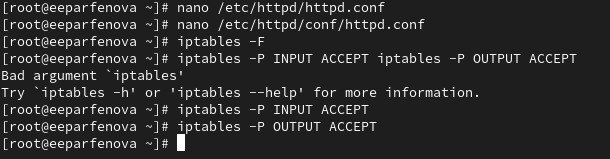{#fig:001 width=70%}

Убедимся, что SELinux работает в режиме enforcing политики targeted с помощью команд *getenforce* и *sestatus*. Видим, что этой действительно так (рис. [-@fig:002])

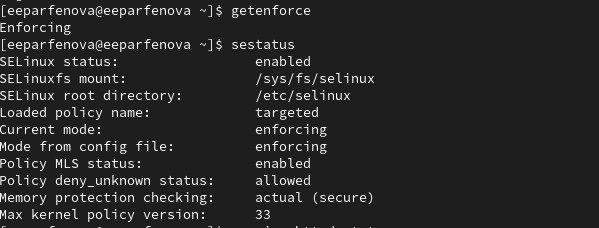{#fig:002 width=70%}


Запустим сервер Apache командой *sudo systemctl start httpd* и с помощью браузера обратимся к нему, убедившись, что сервер работает командой *sydo systemctl status httpd* (рис. [-@fig:003]).

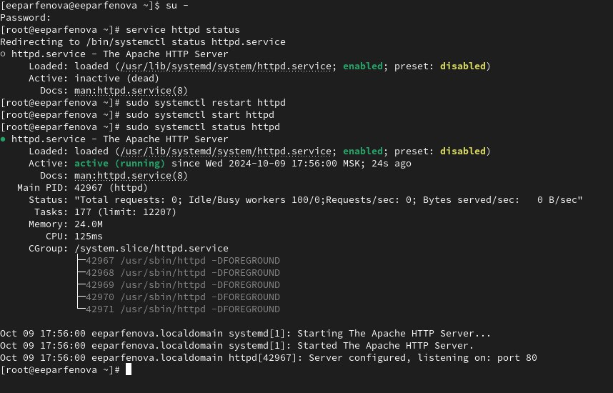{#fig:003 width=70%}

С помощью команд *ps auxZ | grep httpd* и *ps -eZ | grep httpd* найдем веб-сервер Apache в списке процессов, определив его контекст
безопасности. Его контекст безопасности: system_u:system_r:httpd_t:s0. (рис. [-@fig:004])

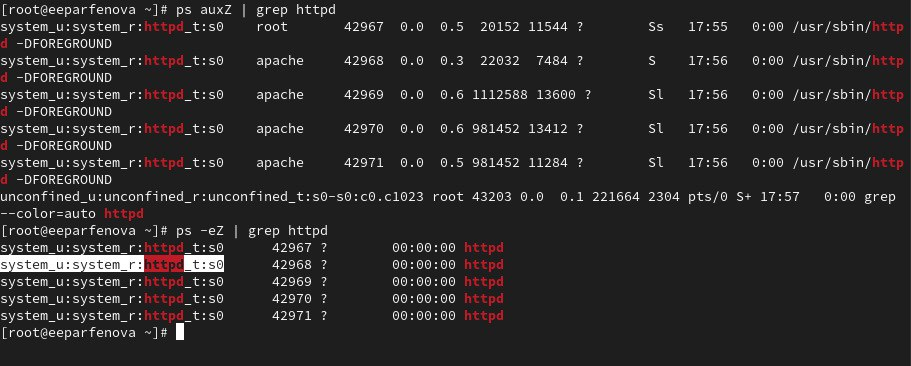{#fig:004 width=70%}

Посмотрим текущее состояние переключателей SELinux для Apache с помощью команды
*sestatus -b | grep httpd*. Обратим внимание, что многие из них находятся в положении «off». (рис. [-@fig:005])

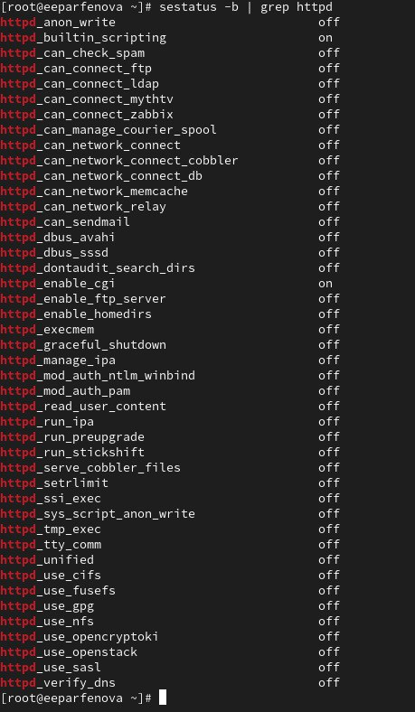{#fig:005 width=70%}


Посмотрим статистику по политике с помощью команды *seinfo* (рис. [-@fig:006]), также определим множество пользователей, ролей, типов с помощью команд *seinfo -u*, *seinfo -r*, *seinfo -t* соответственно (рис. [-@fig:007]). Оно соотвсевтенно равно 8, 15, 5145.

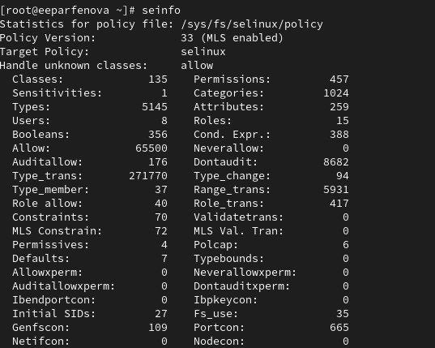{#fig:006 width=70%}

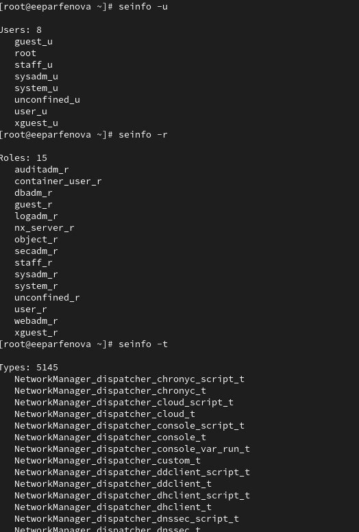{#fig:007 width=70%}

Определим тип файлов и поддиректорий, находящихся в директории /var/www, с помощью команды *ls -lZ /var/www*. Видим, что все файлы и поддиректории принадлежат пользователю root, а также имеют некоторый контекст безопасностиОпределим тип файлов, находящихся в директории /var/www/html *ls -lZ /var/www/html*. Она оказалась пуста. (рис. [-@fig:008])

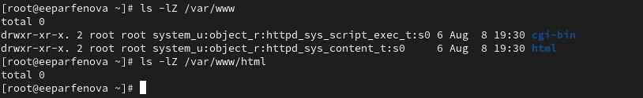{#fig:008 width=70%}

Как уже было указано, создание файлов в директории /var/www/html доступно только владельцу, то есть пользователю root.

Создадим от имени суперпользователя html-файл */var/www/html/test.html* следующего содержания:

```
<html>
<body>test</body>
</html>
```

Проверим его контекст, присовенный по умолчанию созданным файлам в директории
/var/www/html: unconfined_u:object_r:httpd_sys_content_r:s0
(рис. [-@fig:009]). 

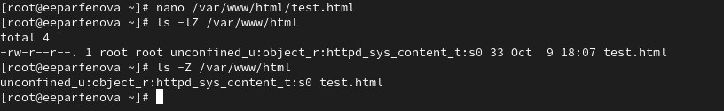{#fig:009 width=70%}

Обратимся к файлу через веб-сервер, введя в браузере адрес
http://127.0.0.1/test.html убедимся, что файл был успешно отображён (рис. [-@fig:010]).


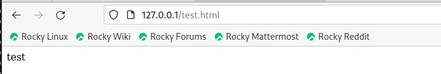{#fig:010 width=70%}

Изучив справку man httpd_selinux, увидим, что для файла test.html был определен один из контекстов безопасности httpd. Проверить контекст файла можно командой.
*ls -Z /var/www/html/test.html* (мы уже делали это ранее, на рис. 9)

Рассмотрим полученный контекст детально. 
- Обратим внимание, что так как по умолчанию пользователи являются свободными от типа, созданному нами
файлу test.html был сопоставлен SELinux, пользователь unconfined_u. Это первая часть контекста.
- Далее политика ролевого разделения доступа RBAC используется процессами, но не файлами, поэтому роли не имеют никакого значения для
файлов. Роль object_r используется по умолчанию для файлов на «постоянных» носителях и на сетевых файловых системах. 
- Тип httpd_sys_content_t позволяет процессу httpd получить доступ к файлу. Благодаря наличию последнего типа мы получили доступ к файлу
при обращении к нему через браузер.

Изменим контекст файла /var/www/html/test.html с httpd_sys_content_t на любой другой, к которому процесс httpd не
должен иметь доступа, например, на samba_share_t. Сдлаем это с помощью команды *chcon -t samba_share_t /var/www/html/test.html*. Затем проверим успешность действия командой *ls -Z /var/www/html/test.html* (рис. [-@fig:011]).

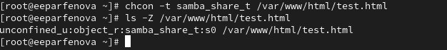{#fig:011 width=70%}

Попробуем ещё раз получить доступ к файлу через веб-сервер, введя в
браузере адрес http://127.0.0.1/test.html. Но получаем следующее сообщение об ошибке (рис. [-@fig:012]): 
```
Forbidden
You don't have permission to access /test.html on this server.
```

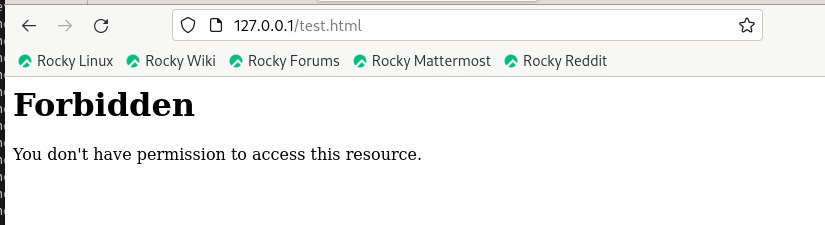{#fig:012 width=70%}

Данная ситуация произошла, так как конекст безопасности был изменен на то, к которому httpd не имеет доуступа, то есть читать файл по прежнему могут все, но отображать его через браузер запрещено.

Просмотрим log-файлы веб-сервера Apache. Просмотрим системный лог-файл командой *tail /var/log/messages* (рис. [-@fig:013]) и файл /var/log/audit/audit.log с помощью команды *tail /var/log/audit/audit.log* (рис. [-@fig:014]).
Видим в системе запущены процессы setroubleshootd и audtd, которые свидетельствуют об ошибке доступа - пишется, что SELinux препятствует серверу в получении полного доступа к вызываемому файлу (это и является причиной, почему мы не можем прочесть его через браузер).

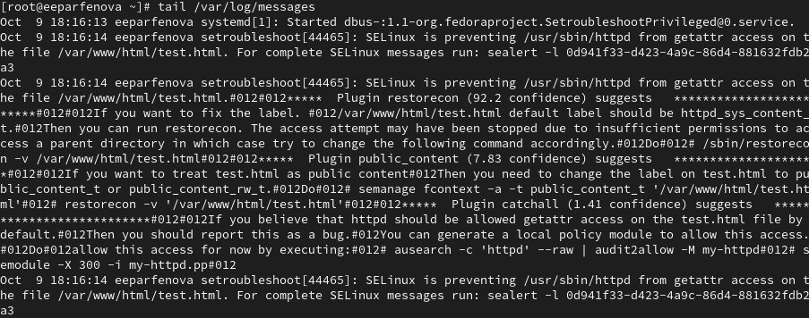{#fig:013 width=70%}

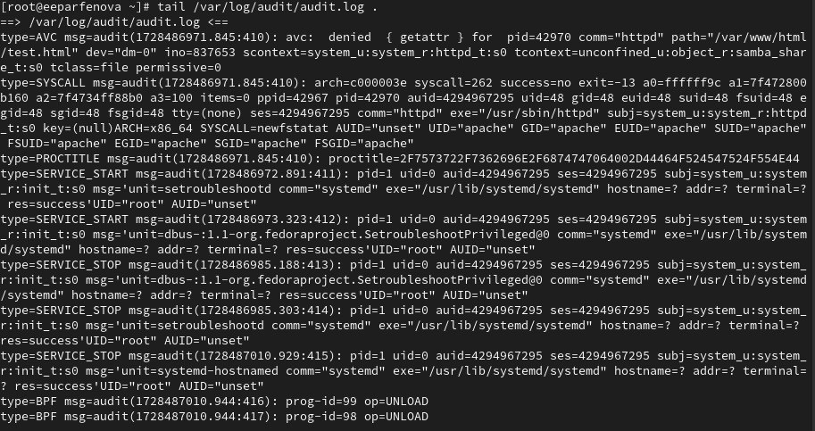{#fig:014 width=70%}

Попробуем запустить веб-сервер Apache на прослушивание ТСР-порта
81 (а не 80). Для этого в файле /etc/httpd/httpd.conf найдем строчку *Listen 80* и
заменим её на Listen 81 (рис. [-@fig:015]).

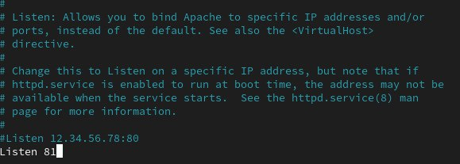{#fig:015 width=70%}

Выполним перезапуск веб-сервера Apache. У нас произошел сбой, так как порт настроен на 80 порт, а мы пытаемся запустить его с 81 (рис. [-@fig:016]).

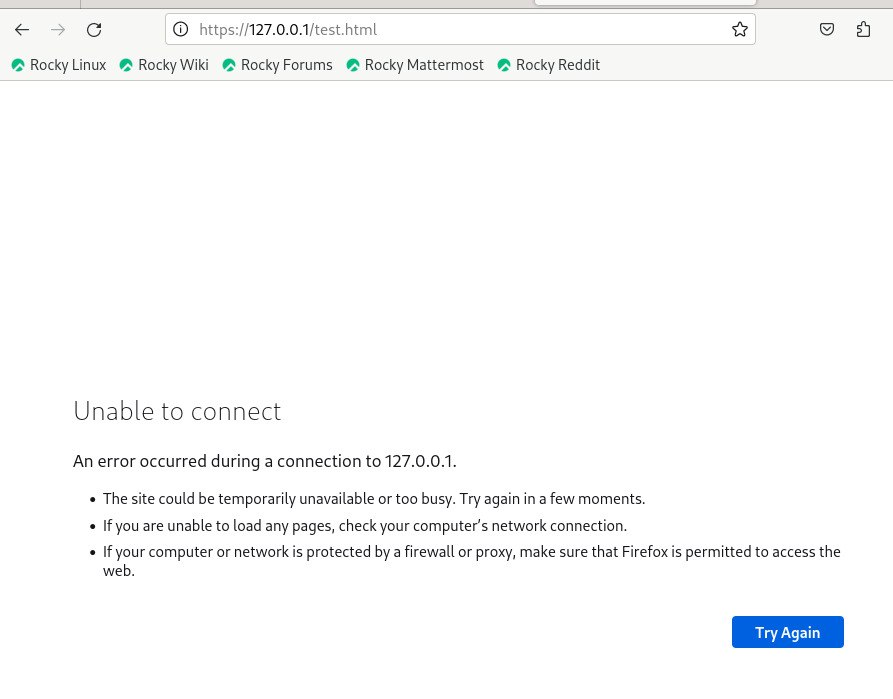{#fig:016 width=70%}

Проанализируйте лог-файлы с помощью команд  *tail -l /var/log/messages* (рис. [-@fig:017]), *tail -l /var/log/http/error_log* и *tail -l /var/log/http/access_log*..

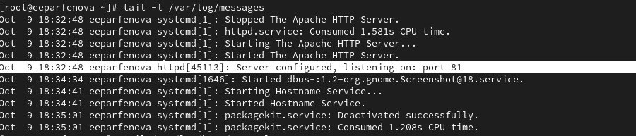{#fig:017 width=70%}

Видим, что есть сообщение, что файл сконфигурирован и прослушивается с 81 порта. Также у нас появилась новая запись в лог-файла ошибок о невозможности загрузки, и не появилось новой записи в лог-файле доступа.

Выполним команду *semanage port -a -t http_port_t -р tcp 81*, добавив 81 порт в список подключенных портов. После этого проверим список портов командой
*semanage port -l | grep http_port_t* Убедимся, что порт 81 появился в списке (он у нас еще и повторяется дважды) (рис. [-@fig:018]).

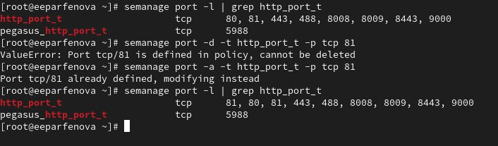{#fig:018 width=70%}


Попробуем запустить веб-сервер Apache ещё раз, но и в этот раз у меня произошел сбой, так как указан не тот контекст. Вернем контекст httpd_sys_cоntent__t к файлу /var/www/html/ test.html командой *chcon -t httpd_sys_content_t /var/www/html/test.html* (рис. [-@fig:019]).
После этого попробуем получить доступ к файлу через веб-сервер, введя в браузере адрес http://127.0.0.1:81/test.html, и на этот раз мы действительно смогли прочитать файл через браузер, увидев содержимое файла — слово «test». (рис. [-@fig:020])

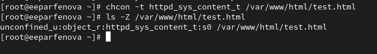{#fig:019 width=70%}

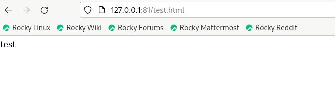{#fig:020 width=70%}

В конце вернем все, что изменили на место: исправим обратно конфигурационный файл apache, вернув Listen 80; удалим привязку http_port_t к 81 порту командой  *semanage port -d -t http_port_t -p tcp 81*; проверим, что порт 81 удалён; удалим файл /var/www/html/test.html командой 
*rm /var/www/html/test.html* (рис. [-@fig:021])

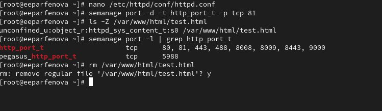{#fig:021 width=70%}

# Выводы

Мы развили навыки администрирования ОС Linux и получили первое практическое знакомство с технологией SELinux. Для этого мы проверили работу SELinx на практике совместно с веб-сервером Apache.

# Список литературы{.unnumbered}

::: {#refs}
:::
