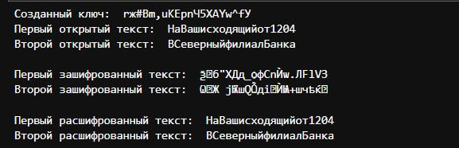

---
## Front matter
lang: ru-RU
title: Лабораторная работа №8
subtitle: Элементы криптографии. Шифрование (кодирование) различных исходных текстов одним ключом
author:
  - Парфенова Е. Е.
teacher:
  - Кулябов Д. С.
  - д.ф.-м.н., профессор
  - профессор кафедры прикладной информатики и теории вероятностей
institute:
  - Российский университет дружбы народов, Москва, Россия
date: 25 октября 2024

## i18n babel
babel-lang: russian
babel-otherlangs: english

## Formatting pdf
toc: false
toc-title: Содержание
slide_level: 2
aspectratio: 169
section-titles: true
theme: metropolis
header-includes:
 - \metroset{progressbar=frametitle,sectionpage=progressbar,numbering=fraction}
---

# Информация

## Докладчик

:::::::::::::: {.columns align=center}
::: {.column width="70%"}

  * Парфенова Елизавета Евгеньвена
  * студент
  * Российский университет дружбы народов
  * [1032216437@pfur.ru](mailto:1032216437@pfur.ru)
  * <https://github.com/parfenovaee>

:::
::: {.column width="30%"}


:::
::::::::::::::

# Вводная часть

## Актуальность

Важность понимания способов шифрования сообщений для обеспечения их макисмальной безопасности

## Цели и задачи

**Цель**: Освоить на практике применение режима однократного гаммирования на примере кодирования различных исходных текстов одним ключом.

**Задача**: Два текста кодируются одним ключом (однократное гаммирование). Требуется не зная ключа и не стремясь его определить, прочитать оба текста. 

1. Необходимо разработать приложение, позволяющее шифровать и дешифровать тексты $P_1$ и $P_2$ в режиме однократного гаммирования. Приложение должно определить вид шифротекстов $C_1$ и $C_2$ обоих текстов $P_1$ и $P_2$ при известном ключе

2. Необходимо определить и выразить аналитически способ, при котором злоумышленник может прочитать оба текста, не зная ключа и не стремясь его определить

# Теоретическое введение

## Теоретическое введение(1)

**Криптография** — наука о методах обеспечения конфиденциальности, целостности данных, аутентификации, шифрования.

**Гаммиирование**, или Шифр XOR, — метод симметричного шифрования, заключающийся в «наложении» последовательности, состоящей из случайных чисел, на открытый текст. Последовательность 
случайных чисел называется гамма-последовательностью и используется для зашифровывания и расшифровывания данных. 

## Теоретическое введение(2)

С точки зрения теории криптоанализа метод шифрования однократной случайной равновероятной гаммой (однократное гаммирование) той же длины, что и открытый текст, является невскрываемым. Даже
при раскрытии части последовательности гаммы нельзя получить информацию о всём скрываемом тексте.

# Выполнение лабораторной работы

## Функции программы 

- **generate_random_key** - функция генерирует ключ шифрования на основе изначального текста

- **xor** - функция, которая выполняет само гаммирование

- **encrypt** - функция, шифрующая текст по сгенерированному ключу

- **decrypt** - функция, которая, наоборот, расшифровывает шифротекст по определенному ключу

## Листинг программы

```
import random

def generate_random_key(text):
    possible_symbol = list(range(32, 127)) + list(range(1040, 1104))
    key_str = ''.join(chr(random.choice(possible_symbol)) 
        for _ in range(len(text)))
    return key_str

def xor(text, key):
    return [ord(s1)^ord(s2) for s1,s2 in zip(text, key)]
```

## Листинг программы
```
def encrypt(text, key):
    chiphr = xor(text, key)
    chiphrotext = ''.join(chr(i) for i in chiphr)
    return chiphrotext
    
def decrypt(chiphro, key):
    decrypted = xor(chiphro, key)
    opentext = ''.join(chr(i) for i in decrypted)
    return opentext

P1 = "НаВашисходящийот1204"
P2 = "ВСеверныйфилиалБанка"
```

## Листинг программы

```
key = generate_random_key(P1)
print("Созданный ключ: ", key)
C1 = encrypt(P1, key)
C2 = encrypt(P2, key)
print('Первый открытый текст: ', P1)
print('Второй открытый текст: ', P2)
print('Первый зашифрованный текст: ', C1)
print('Второй зашифрованный текст: ', C2)
opentext1 = decrypt(C1, key)
opentext2 = decrypt(C2, key)
print('Первый расшифрованный текст: ', opentext1)
print('Второй расшифрованный текст: ', opentext2)
```
## Результат работы программы 

{#fig:001 width=70%}

## Аналитическое представление

Метод заключается в побитном сложении по модулю 2 двух зашифрованных текстов, которое приводит к тому, что побитно складываются исходные тексы P1 и P2, то есть происходит следующее:

$C1 \oplus C2 = (P1 \oplus K) \oplus (P2 \oplus K) = P1 \oplus P2 (1)$   

## Аналитическое представление

Предположим, что одна из телеграмм является шаблоном — т.е. имеет текст фиксированный формат, в который вписываются значения полей. Допустим, что злоумышленнику этот формат известен. Тогда он получает достаточно много пар $C1 \oplus C2$ (известен вид обеих шифровок). Тогда зная P1 и учитывая (1), имеем:

$C1 \oplus C2 \oplus P1 = P1 \oplus P2 \oplus P1 = P2 (2)$   

## Аналитическое представление

Таким образом, злоумышленник получает возможность определить те символы сообщения P2, которые находятся на позициях известного шаблона сообщения P1. Поиттерационное использование формулы дает ему возможность реально отгадать большую часть зашифрованного текста и уменьшить пространство поиска нужных элементов

## Листинг программы

```
def recover_text(C1, C2, P1):
    new_P2_num = (ord(c1)^ord(c2)^ord(p1) for c1,c2,p1 in zip(C1, C2, P1))
    new_P2 = "".join(chr(i) for i in new_P2_num)
    return new_P2

rec_P2 = recover_text(C1, C2, P1)
print('Рашифрованный без ключа второй текст: ',  rec_P2)
```

## Результат расшифровки текста без ключа

{#fig:002 width=70%}

# Вывод

## Выводы

В ходе лабораторной работы было освоено на практике применение режима однократного гаммирования на примере кодирования различных исходных текстов одним ключом.


