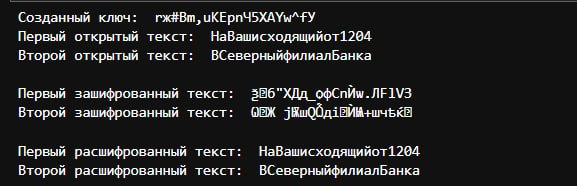

---
## Front matter
title: "Лабораторная работа №8"
subtitle: "Элементы криптографии. Шифрование (кодирование) различных исходных текстов одним ключом"
author: "Парфенова Елизавета Евгеньевна"

## Generic otions
lang: ru-RU
toc-title: "Содержание"

## Bibliography
bibliography: bib/cite.bib
csl: pandoc/csl/gost-r-7-0-5-2008-numeric.csl

## Pdf output format
toc: true # Table of contents
toc-depth: 2
lof: true # List of figures
lot: true # List of tables
fontsize: 12pt
linestretch: 1.5
papersize: a4
documentclass: scrreprt
## I18n polyglossia
polyglossia-lang:
  name: russian
  options:
	- spelling=modern
	- babelshorthands=true
polyglossia-otherlangs:
  name: english
## I18n babel
babel-lang: russian
babel-otherlangs: english
## Fonts
mainfont: IBM Plex Serif
romanfont: IBM Plex Serif
sansfont: IBM Plex Sans
monofont: IBM Plex Mono
mathfont: STIX Two Math
mainfontoptions: Ligatures=Common,Ligatures=TeX,Scale=0.94
romanfontoptions: Ligatures=Common,Ligatures=TeX,Scale=0.94
sansfontoptions: Ligatures=Common,Ligatures=TeX,Scale=MatchLowercase,Scale=0.94
monofontoptions: Scale=MatchLowercase,Scale=0.94,FakeStretch=0.9
mathfontoptions:
## Biblatex
biblatex: true
biblio-style: "gost-numeric"
biblatexoptions:
  - parentracker=true
  - backend=biber
  - hyperref=auto
  - language=auto
  - autolang=other*
  - citestyle=gost-numeric
## Pandoc-crossref LaTeX customization
figureTitle: "Рис."
tableTitle: "Таблица"
listingTitle: "Листинг"
lofTitle: "Список иллюстраций"
lotTitle: "Список таблиц"
lolTitle: "Листинги"
## Misc options
indent: true
header-includes:
  - \usepackage{indentfirst}
  - \usepackage{float} # keep figures where there are in the text
  - \floatplacement{figure}{H} # keep figures where there are in the text
---

# Цель работы

Освоить на практике применение режима однократного гаммирования на примере кодирования различных исходных текстов одним ключом.

# Задание

Два текста кодируются одним ключом (однократное гаммирование). Требуется не зная ключа и не стремясь его определить, прочитать оба текста. 

1. Необходимо разработать приложение, позволяющее шифровать и дешифровать тексты $P_1$ и $P_2$ в режиме однократного гаммирования. Приложение должно определить вид шифротекстов $C_1$ и $C_2$ обоих текстов $P_1$ и $P_2$ при известном ключе;
2. Необходимо определить и выразить аналитически способ, при котором злоумышленник может прочитать оба текста, не зная ключа и не стремясь его определить.

# Теоретическое введение

**Криптография** — наука о методах обеспечения конфиденциальности, целостности данных, аутентификации, шифрования[@harm:bash].

**Гаммиирование**, или Шифр XOR, — метод симметричного шифрования, заключающийся в «наложении» последовательности, состоящей из случайных чисел, на открытый текст. Последовательность 
случайных чисел называется гамма-последовательностью и используется для зашифровывания и расшифровывания данных[@cript:bash]. 

С точки зрения теории криптоанализа метод шифрования однократной случайной равновероятной гаммой (однократное гаммирование) той же длины, что и открытый текст, является невскрываемым[@chipr:bash]. Даже при раскрытии части последовательности гаммы нельзя получить информацию о всём скрываемом тексте.

# Выполнение лабораторной работы

1. В ходе лабораторной работы было разработано требуемое приложение. Оно имеет следующие функции:

- **generate_random_key** - функция генерирует ключ шифрования на основе изначального текста. Ключ шифрования состоит из букв кириллицы, латиницы, цифр и различных символов;

- **xor** - функция, которая выполняет само гаммирование, накладывая гамму на скрываемый текст (по сути происходит сложение по модулю 2);

- **encrypt** - функция, шифрующая текст по сгенерированному ключу. Она совершает гаммирование и формирует сам шифротекст;

- **decrypt** - функция, которая, наоборот, расшифровывает шифротекст по определенному ключу. Работает анологично encrypt, только формируя в конце открытый текст;

Вторая часть программы производит вызов всех созданных функций в определнной последовательности и совершает вывод необходимой информации: сгенерированного ключа, двух изначальных текстов (я взяла фразы из файла лабораторной работы), зашифрованных текстов, расшифрованных с помощью ключа текстов


Далее следует листинг описанной программы:

```
import random

def generate_random_key(text):
    possible_symbol = list(range(32, 127)) + list(range(1040, 1104))
    key_str = ''.join(chr(random.choice(possible_symbol)) for _ in range(len(text)))
    return key_str

def xor(text, key):
    return [ord(s1)^ord(s2) for s1,s2 in zip(text, key)]

def encrypt(text, key):
    chiphr = xor(text, key)
    chiphrotext = ''.join(chr(i) for i in chiphr)
    return chiphrotext
    
def decrypt(chiphro, key):
    decrypted = xor(chiphro, key)
    opentext = ''.join(chr(i) for i in decrypted)
    return opentext

P1 = "НаВашисходящийот1204"
P2 = "ВСеверныйфилиалБанка"

key = generate_random_key(P1)
print("Созданный ключ: ", key)

C1 = encrypt(P1, key)
C2 = encrypt(P2, key)
print('Первый открытый текст: ', P1)
print('Второй открытый текст: ', P2)
print('')
print('Первый зашифрованный текст: ', C1)
print('Второй зашифрованный текст: ', C2)
print('')
opentext1 = decrypt(C1, key)
opentext2 = decrypt(C2, key)
print('Первый расшифрованный текст: ', opentext1)
print('Второй расшифрованный текст: ', opentext2)
```
При запуске программы мы получили следующий вывод (рис. [-@fig:001]).

{#fig:001 width=70%}

2. Далее нам было необходимо определить и аналитичсеки описать способ, при котором злоумышленник может прочитать оба текста, не зная ключа и не стремясь его определить. 

*Аналитичсекое описание:*

Для задачи, где мы иммем два зашифрованных текста C1 и C2 с помощью однократного гаммирования (XOR), есть способ рашифровки этих текстов посредством друг друга, без ключа. Метод заключается в побитном сложении по модулю 2 (то есть выполнение операции XOR) двух зашифрованных текстов, которое приводит к тому, что побитно складываются исходные тексы P1 и P2, то есть происходит следующее:

$C1 \oplus C2 = (P1 \oplus K) \oplus (P2 \oplus K) = P1 \oplus P2$   (1)

То есть ключ при дешифровании уничтожается. Таким образом, злоумышленник может вычислить открытые тексты P1 и P2 с помощью их зашифрованныъ версий, не зная ключ. 

Предположим, что одна из телеграмм является шаблоном — т.е. имеет текст фиксированный формат, в который вписываются значения полей. Допустим, что злоумышленнику этот формат известен. Тогда он получает достаточно много пар $C1 \oplus C2$ (известен вид обеих шифровок). Тогда зная P1 и учитывая (1), имеем:

$C1 \oplus C2 \oplus P1 = P1 \oplus P2 \oplus P1 = P2$   (2)

Таким образом, злоумышленник получает возможность определить те символы сообщения P2, которые находятся на позициях известного шаблона сообщения P1. В соответствии с логикой сообщения P2, злоумышленник имеет реальный шанс узнать ещё некоторое количество символов сообщения P2. Затем вновь используется (2) с подстановкой вместо P1 полученных на предыдущем шаге новых символов сообщения P2. И так далее. Действуя подобным образом, злоумышленник даже если не прочитает оба
сообщения, то значительно уменьшит пространство их поиска.

Далее мы попробовали проверить формулу (2) на практике. Для этого было написано дополнение к приложению:

- **recover_text** - функция, которая рашифровывет один из текстов с помощью двух шифротекстов (зашифрованы с помощью одного ключа) и второго открытого текста. 

Вторая часть дополнения программы вызывает эту функцию и выводит на экран расшифрованный без ключа текст.

Далее представлен листинг этого дополнения:

```
def recover_text(C1, C2, P1):
    new_P2_num = (ord(c1)^ord(c2)^ord(p1) for c1,c2,p1 in zip(C1, C2, P1))
    new_P2 = "".join(chr(i) for i in new_P2_num)
    return new_P2

rec_P2 = recover_text(C1, C2, P1)
print('Рашифрованный без ключа второй текст: ',  rec_P2)
```

Если посмотреть на вывод программы (рис. [-@fig:001]), видим, что с помощью двух созданных ранее шифротекстов $C_1$ и $C_2$, а также открытого текста *P_1* был успешно расшифрован текст $P_2$. Также работает и в обратную сторону (для текста $P_1$).

{#fig:002 width=70%}


# Контрольные вопросы

1. Как, зная один из текстов (P1 или P2), определить другой, не зная при этом ключа?

Метод заключается в их побитном сложении по модулю 2 (то есть выполнение операции XOR), которое приводит к тому, что побитно складываются исходные тексы P1 и P2, то есть происходит следующее:

$C1 \oplus C2 = (P1 \oplus K) \oplus (P2 \oplus K) = P1 \oplus P2$   (1)

То есть ключ при дешифровании уничтожается. Таким образом, злоумышленник может вычислить открытые тексты P1 и P2 с помощью их зашифрованныъ версий, не зная ключ. 

2. Что будет при повторном использовании ключа при шифровании текста?

При повторном использовании ключа в шифровании текста возникает риск компрометации безопасности, так как это может привести к возможности криптоанализа. Если два текста зашифрованы одним и тем же ключом, злоумышленник может выполнить XOR-операцию над шифротекстами, что может раскрыть информацию о структуре открытых текстов.

3. Как реализуется режим шифрования однократного гаммирования одним ключом двух открытых текстов?

Режим шифрования однократного гаммирования двумя открытыми текстами реализуется путем применения одного и того же ключа к обоим текстам, используя операцию XOR. Шифротексты формируются по формуле:

$C1  = (P1 \oplus Key)$

$C2  = (P2 \oplus Key)$

4. Перечислите недостатки шифрования одним ключом двух открытых текстов.

- Уязвимость к криптоанализу при повторном использовании ключа
- Потенциальная утечка информации при сравнении шифротекстов
- Необходимость хранения и передачи длинных случайных ключей для обеспечения безопасности

5. Перечислите преимущества шифрования одним ключом двух открытых текстов.

- Высокий уровень безопасности при условии использования уникального ключа для каждого сеанса.
- Простота реализации алгоритма (например, XOR-операция)
- Отсутствие необходимости в сложных вычислениях для шифрования и дешифрования

# Выводы

В ходе лабораторной работы было освоено на практике применение режима однократного гаммирования на примере кодирования различных исходных текстов одним ключом.

# Список литературы{.unnumbered}

::: {#refs}
:::
