---
## Front matter
lang: ru-RU
title: Индивидуальный проект. Этап 1
subtitle: Установка Kali Linux
author:
  - Парфенова Е. Е.
teacher:
  - Кулябов Д. С.
  - д.ф.-м.н., профессор
  - профессор кафедры прикладной информатики и теории вероятностей
institute:
  - Российский университет дружбы народов, Москва, Россия
date: 14 сентября 2024

## i18n babel
babel-lang: russian
babel-otherlangs: english

## Formatting pdf
toc: false
toc-title: Содержание
slide_level: 2
aspectratio: 169
section-titles: true
theme: metropolis
header-includes:
 - \metroset{progressbar=frametitle,sectionpage=progressbar,numbering=fraction}
---

# Информация

## Докладчик

:::::::::::::: {.columns align=center}
::: {.column width="70%"}

  * Парфенова Елизавета Евгеньвена
  * студент
  * Российский университет дружбы народов
  * [1032216437@pfur.ru](mailto:1032216437@pfur.ru)
  * <https://github.com/parfenovaee>

:::
::: {.column width="30%"}

:::
::::::::::::::

# Вводная часть

## Актуальность

- Необходимость установки данной операционной системы для дальнейшего выполнения индивидуального проекта
- Возможность закрепить знания по установке ОС на виртуальные машины 

## Цели и задачи

**Цель**: Закрепление навыков по установке операционной системы на виртуальную машину, которая понадобится для дальнейшего выполнения проекта

**Задача**: Установка дистрибутива Kali Linux на виртуальную машину VirtualBox

# Теоретическое введение 

## Теоретичсекое введение(1)

**Виртуальная машина (VM, от англ. virtual machine)** — программная или аппаратная система, эмулирующая аппаратное обеспечение компьютера и исполняющая программы для guest-платформы (guest — гостевая платформа) на host-платформе (host — хост-платформа, платформа-хозяин) или виртуализирующая некоторую платформу и создающая на ней среды, изолирующие друг от друга программы и даже операционные системы

**VirtualBox (Oracle VM VirtualBox)** — программный продукт виртуализации для операционных систем Windows, Linux, FreeBSD, macOS, Solaris/OpenSolaris, ReactOS, DOS и других 

## Теоретичсекое введение(2)

**Linux (в части случаев GNU/Linux)** — семейство Unix-подобных операционных систем на базе ядра Linux, включающих тот или иной набор утилит и программ проекта GNU, и, возможно, другие компоненты. 

**Kali Linux** — GNU/Linux-LiveCD, возникший как результат слияния WHAX и Auditor Security Collection. Проект создали Мати Ахарони  и Макс Мозер. Предназначен прежде всего для проведения тестов на безопасность. 

# Выполнение первого этапа проекта

## Создание виртуальной машины 

1. 
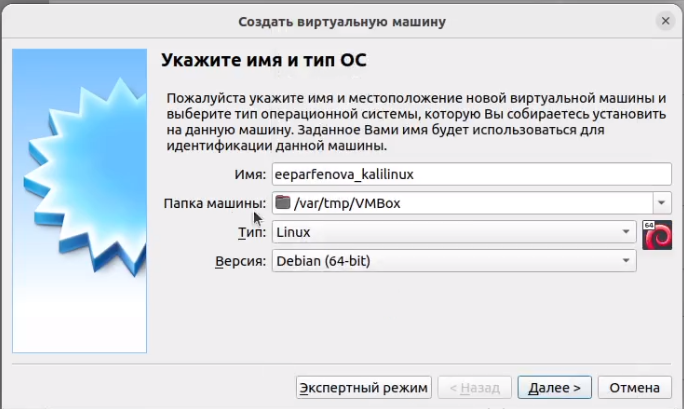{#fig:001 width=40%}

## Создание виртуальной машины  

2. Размер основной памяти виртуальной машины

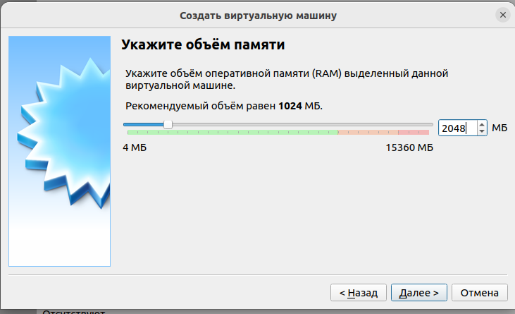{#fig:002 width=40%}

## Создание виртуальной машины 

3. Конфигурация жесткого диска: загрузочный, VDI, динамический

:::::::::::::: {.columns align=center}
::: {.column width="50%"}

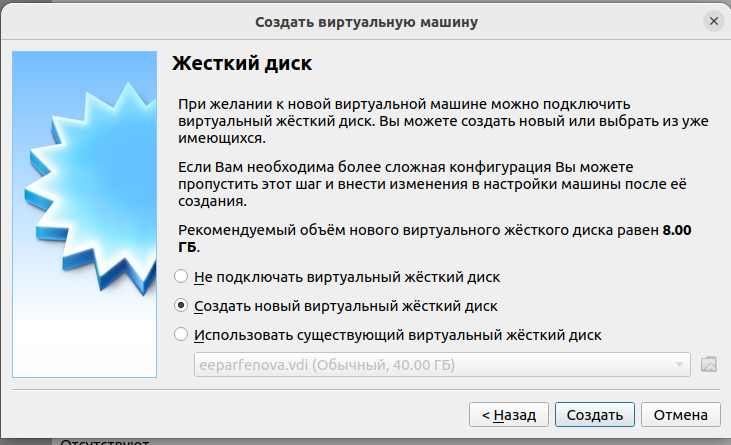{#fig:003 width=50%}

:::
::: {.column width="50%"}

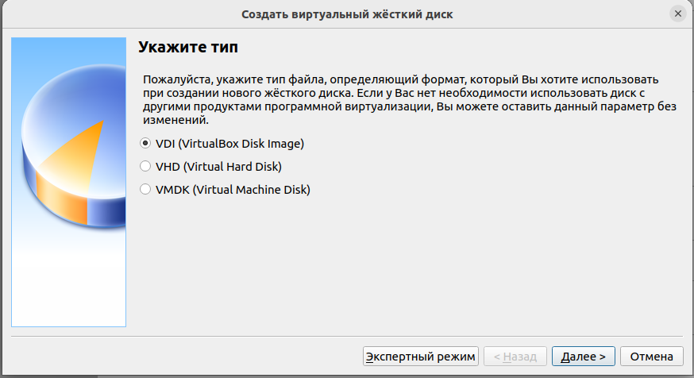{#fig:004 width=50%}

:::
::::::::::::::

## Создание виртуальной машины 

:::::::::::::: {.columns align=center}
::: {.column width="50%"}

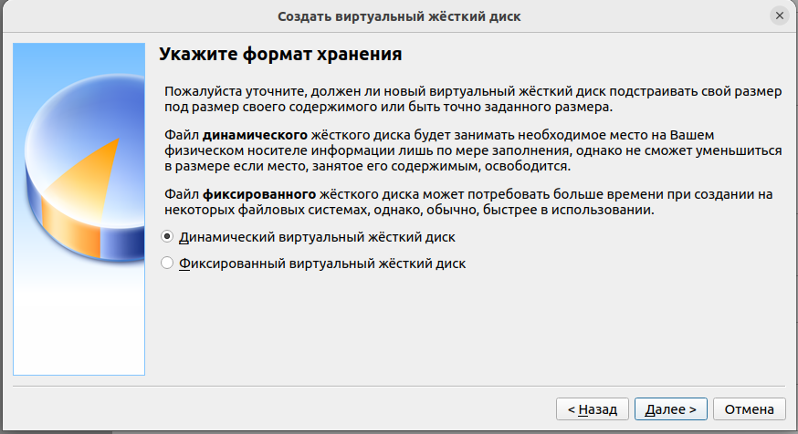{#fig:005 width=50%}

:::
::: {.column width="50%"}

4. Размер жесткого диска

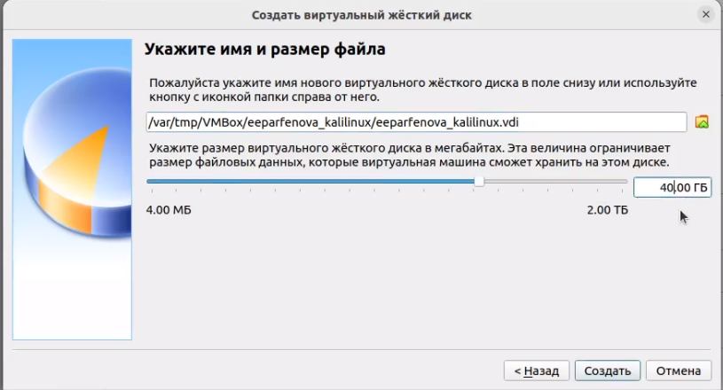{#fig:006 width=50%}

:::
::::::::::::::

## Создание виртуальной машины 

5. Добавление образа операционной системы

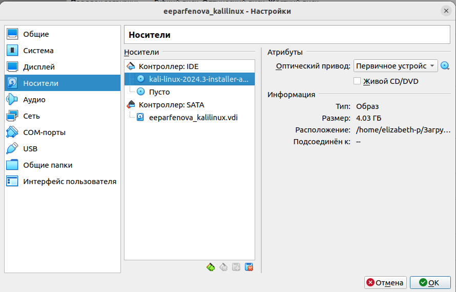{#fig:007 width=40%}

## Установка Kali Linux

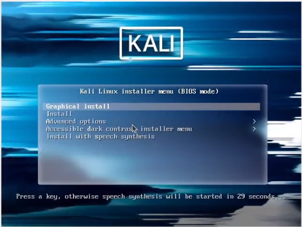{#fig:008 width=50%}

## Установка Kali Linux

:::::::::::::: {.columns align=center}
::: {.column width="50%"}

1. Выборя языка установки

{#fig:009 width=50%}

:::
::: {.column width="50%"}

2. Выбор локации

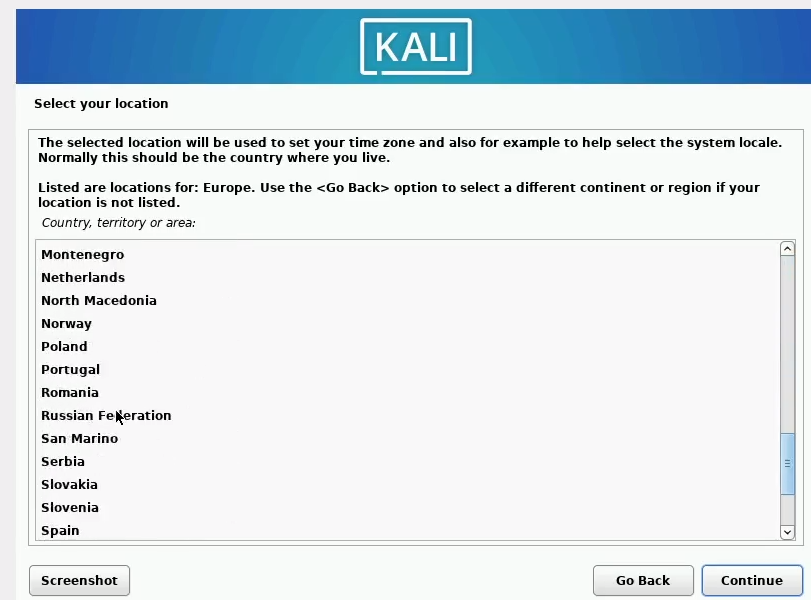{#fig:010 width=50%}

:::
::::::::::::::

## Установка Kali Linux

:::::::::::::: {.columns align=center}
::: {.column width="50%"}

4. Указание имени хоста 

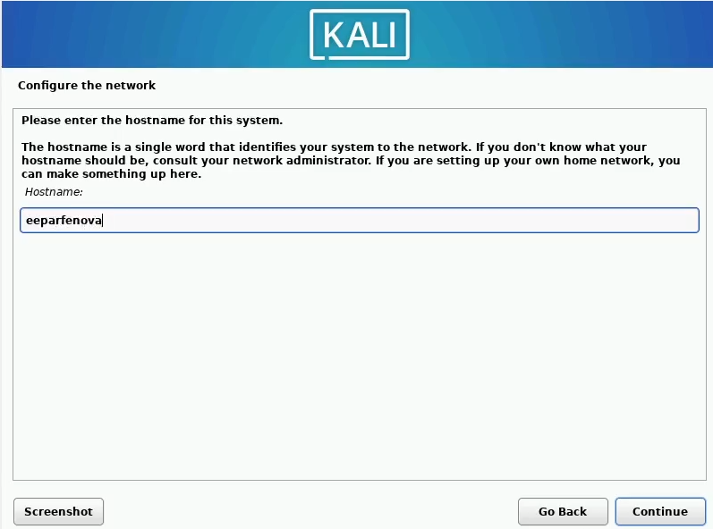{#fig:011 width=60%}

:::
::: {.column width="50%"}

5. Указание домена

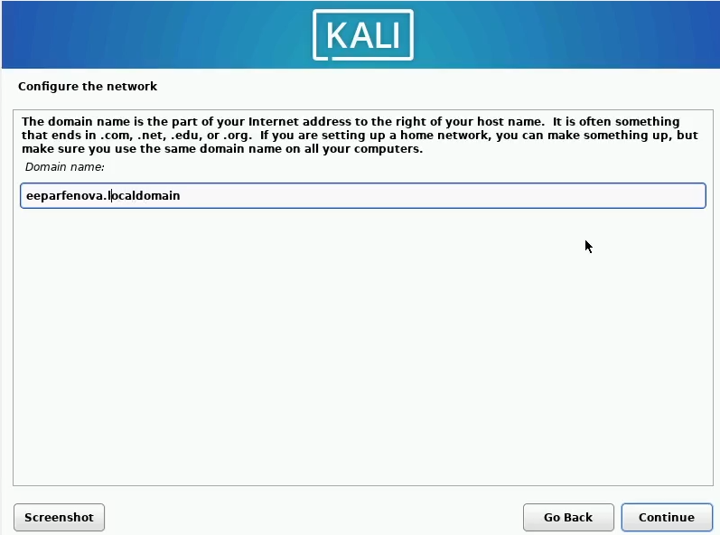{#fig:012 width=60%}

:::
::::::::::::::

## Установка Kali Linux

:::::::::::::: {.columns align=center}
::: {.column width="50%"}

4. Указание имени пользователя

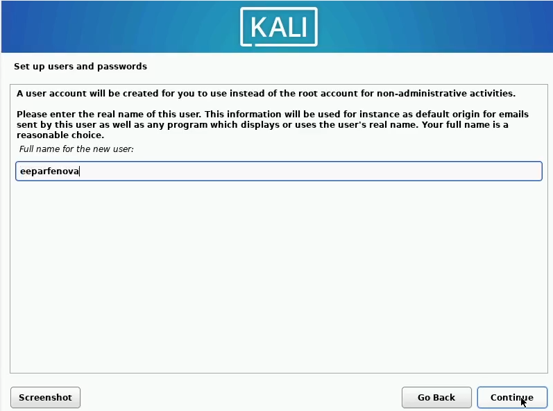{#fig:013 width=60%}

:::
::: {.column width="50%"}

5. Указание имени аакаунта

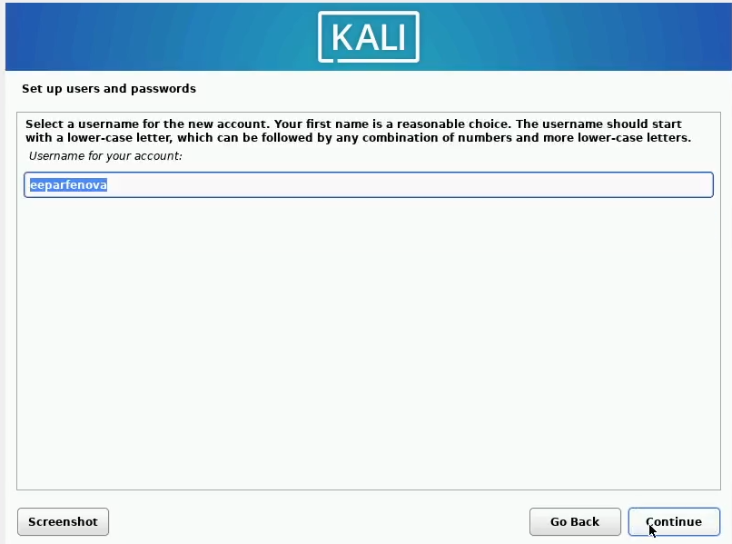{#fig:014 width=60%}

:::
::::::::::::::

## Установка Kali Linux

6. Установка пароля

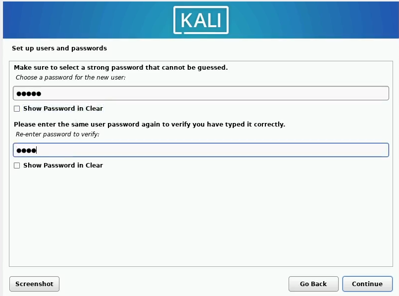{#fig:015 width=50%}

## Установка Kali Linux

7. Разделение жесткого диска

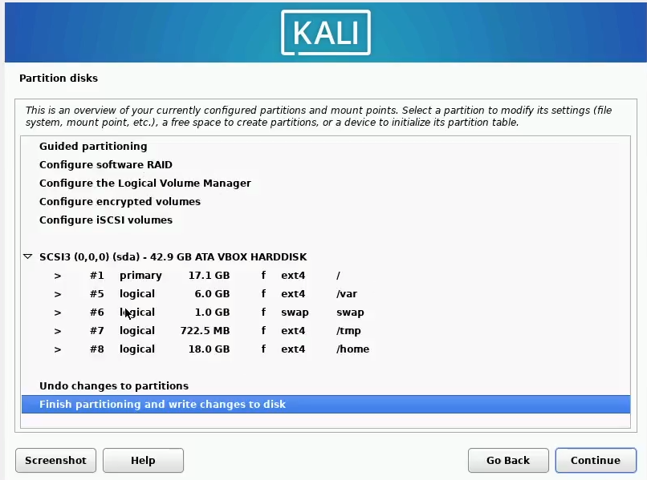{#fig:016 width=50%}

## Установка Kali Linux

8.  Выбор необходимого ПО для устанвоки

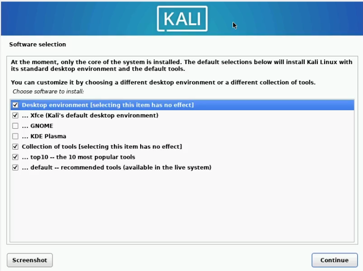{#fig:017 width=50%}

## Установка Kali Linux

9. Устанвока GRUB 

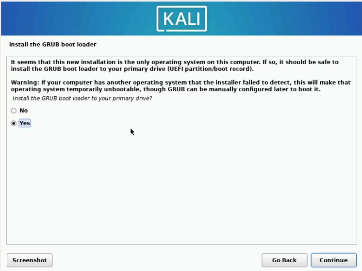{#fig:018 width=50%}

## Установка Kali Linux

:::::::::::::: {.columns align=center}
::: {.column width="50%"}

4. Ввод данных учетной записи

{#fig:019 width=70%}

:::
::: {.column width="50%"}

5. Установленная система Kali Linux

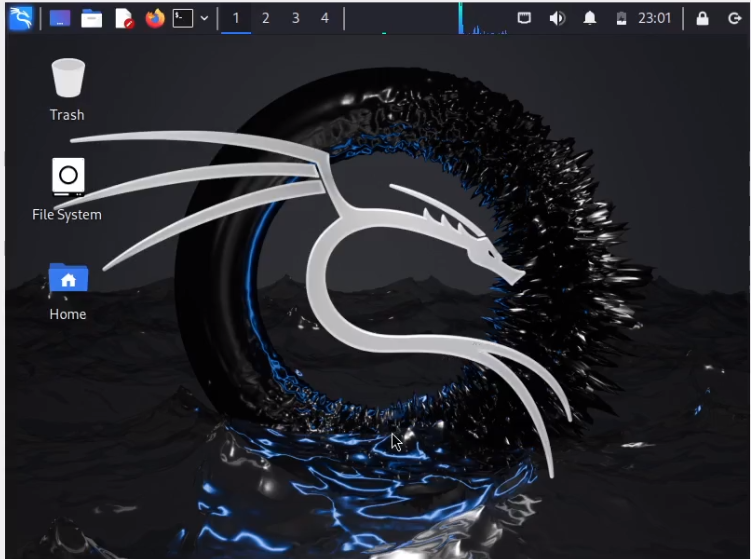{#fig:022 width=70%}

:::
::::::::::::::

# Вывод

## Выводы 

Мы успешно установили ОС Kali Linux на виртуальную машину и готовы к дельнейшему выполнению проекта

