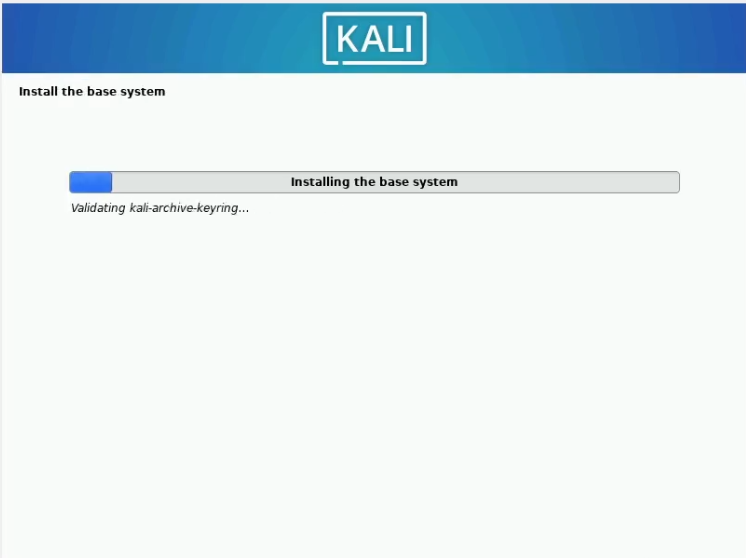

---
## Front matter
title: "Индивидуальный проект. Этап 1"
subtitle: "Установка Kali Linux"
author: "Парфенова Елизавета Евгеньевна"

## Generic otions
lang: ru-RU
toc-title: "Содержание"

## Bibliography
bibliography: bib/cite.bib
csl: pandoc/csl/gost-r-7-0-5-2008-numeric.csl

## Pdf output format
toc: true # Table of contents
toc-depth: 2
lof: true # List of figures
lot: true # List of tables
fontsize: 12pt
linestretch: 1.5
papersize: a4
documentclass: scrreprt
## I18n polyglossia
polyglossia-lang:
  name: russian
  options:
	- spelling=modern
	- babelshorthands=true
polyglossia-otherlangs:
  name: english
## I18n babel
babel-lang: russian
babel-otherlangs: english
## Fonts
mainfont: IBM Plex Serif
romanfont: IBM Plex Serif
sansfont: IBM Plex Sans
monofont: IBM Plex Mono
mathfont: STIX Two Math
mainfontoptions: Ligatures=Common,Ligatures=TeX,Scale=0.94
romanfontoptions: Ligatures=Common,Ligatures=TeX,Scale=0.94
sansfontoptions: Ligatures=Common,Ligatures=TeX,Scale=MatchLowercase,Scale=0.94
monofontoptions: Scale=MatchLowercase,Scale=0.94,FakeStretch=0.9
mathfontoptions:
## Biblatex
biblatex: true
biblio-style: "gost-numeric"
biblatexoptions:
  - parentracker=true
  - backend=biber
  - hyperref=auto
  - language=auto
  - autolang=other*
  - citestyle=gost-numeric
## Pandoc-crossref LaTeX customization
figureTitle: "Рис."
tableTitle: "Таблица"
listingTitle: "Листинг"
lofTitle: "Список иллюстраций"
lotTitle: "Список таблиц"
lolTitle: "Листинги"
## Misc options
indent: true
header-includes:
  - \usepackage{indentfirst}
  - \usepackage{float} # keep figures where there are in the text
  - \floatplacement{figure}{H} # keep figures where there are in the text
---

# Цель работы

Закрепление навыков по установке операционной системы на виртуальную машину, которая понадобится для дальнейшего выполнения проекта

# Задание

Установка дистрибутив Kali Linux в виртуальную машину VirtualBox

# Теоретическое введение

**Виртуальная машина (VM, от англ. virtual machine)** — программная или аппаратная система, эмулирующая аппаратное обеспечение компьютера и исполняющая программы для guest-платформы (guest — гостевая платформа) на host-платформе (host — хост-платформа, платформа-хозяин) или виртуализирующая некоторую платформу и создающая на ней среды, изолирующие друг от друга программы и даже операционные системы [@wiki_vb:bash]

**VirtualBox (Oracle VM VirtualBox)** — программный продукт виртуализации для операционных систем Windows, Linux, FreeBSD, macOS, Solaris/OpenSolaris, ReactOS, DOS и других [@vb:bash].

**Linux (в части случаев GNU/Linux)** — семейство Unix-подобных операционных систем на базе ядра Linux, включающих тот или иной набор утилит и программ проекта GNU, и, возможно, другие компоненты [@wiki_linux:bash]. 

**Kali Linux** — GNU/Linux-LiveCD, возникший как результат слияния WHAX и Auditor Security Collection. Проект создали Мати Ахарони  и Макс Мозер. Предназначен прежде всего для проведения тестов на безопасность. [@wiki_1:bash]

# Выполнение лабораторной работы

Скачиваем образ диска Kali Linux с официального сайта дистрибутива. [@kl:bash]

Начнем создание новой виртуальной машины. Для этого кликнем на кнопку "Создать". Затем заполним название виртуальной машины в соотсветствии с соглашением об именовании(я добавила _kalilinux, чтобы названия ВМ не совпадали) и ее хааркетиристики (Linux, Debian 64-bit) в открывшемся окне. Также изменим местоположение будущей ВМ - устнаовим ее в корневом каталоге (рис. [-@fig:001]). 

{#fig:001 width=70%}

Далее установим размер основной памяти виртуальной машины в 2048 МБ (рис. [-@fig:002]). Зададим конфигурацию жёсткого диска — загрузочный (рис. [-@fig:003]), VDI (BirtualBox Disk Image) (рис. [-@fig:004]), динамический виртуальный диск (рис. [-@fig:005]). Зададим размер диска в 40 ГБ, его расположение не изменяем (рис. [-@fig:006]).

{#fig:002 width=70%}

{#fig:003 width=70%}

{#fig:004 width=70%}

{#fig:005 width=70%}

{#fig:006 width=70%}

В настройках VirtualBox выбираем вкладку "Носители" и в ней добавляем новый привод оптических дисков. Там выбираем образ операционной системы, который был скачан ранее (рис. [-@fig:007]). 

{#fig:007 width=70%}

После успешного создания виртуальной машины приступаем к установке операционной системы. В начале запускаем виртуальную машину, выбираем "Graphical Install" (рис. [-@fig:008]). 

{#fig:008 width=70%}

Затем начинаем установку ОС на виртуальной машине. В начале выбираем английский язык в качестве языка установки (рис. [-@fig:009]), затем выбраем свою локацию (Российская Федерация) (рис. [-@fig:010]) 

{#fig:009 width=70%}

{#fig:010 width=70%}

Далее указываем имя хоста (рис. [-@fig:011]), домен (рис. [-@fig:012]), имя пользователя (рис. [-@fig:013]), имя аккаунта (рис. [-@fig:014]) и пароль (рис. [-@fig:015]) (Все указано в соотвествии с соглашением об именовании, как и в прошлой ВМ) 

{#fig:011 width=70%}

{#fig:012 width=70%}

{#fig:013 width=70%}

{#fig:014 width=70%}

{#fig:015 width=70%}

Далее настраиваем разделение виртуального диска таким образом, чтобы при установке там сразу были выделены директории /home, /var и /tmp (рис. [-@fig:016])

{#fig:016 width=70%}

Затем дожидаемся конца установки базовой системы (рис. [-@fig:016])

{#fig:017 width=70%}

Затем выбираем необходимое ПО, которое будет установлено (я оставила така, как отметилось изначально) (рис. [-@fig:018]), и ждем, пока все устанвоится (рис. [-@fig:019]). 

{#fig:018 width=70%}

{#fig:019 width=70%}

В самом конце соглашаемся на установку GRUB (рис. [-@fig:020]) и ждем полного окончания устанвоки ОС. Затем перезагружаем систему, как того требуют. 

{#fig:020 width=70%}

После перезагрузки вводим данные учетной записи (рис. [-@fig:021]) и заходим в Kali Linux (рис. [-@fig:022])

{#fig:021 width=70%}

{#fig:022 width=70%}

# Выводы

Мы успешно установили ОС Kali Linux на виртуальную машину и готовы к дельнейшему выполнению проекта

# Список литературы{.unnumbered}

::: {#refs}
:::
