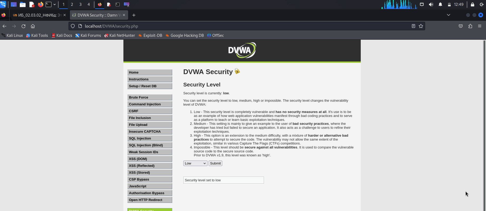
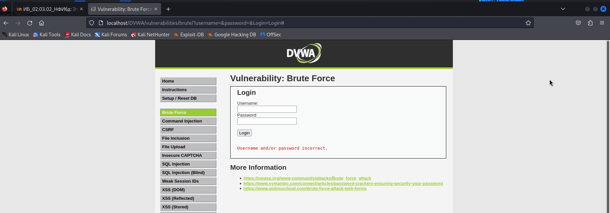
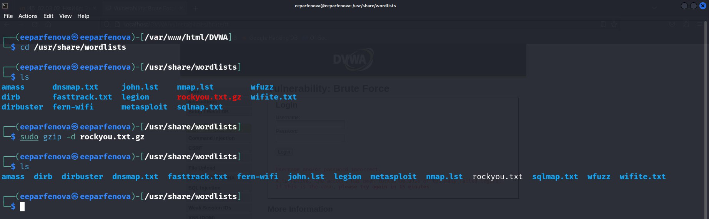
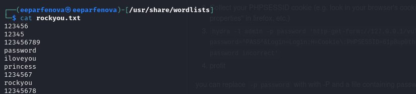
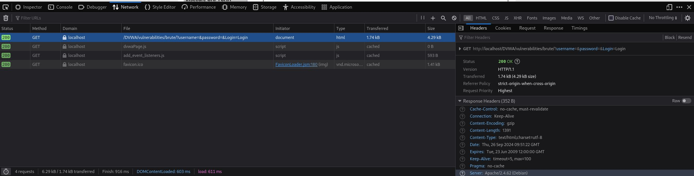
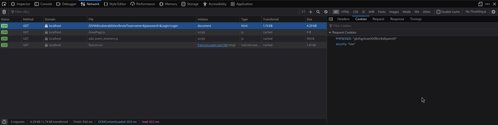
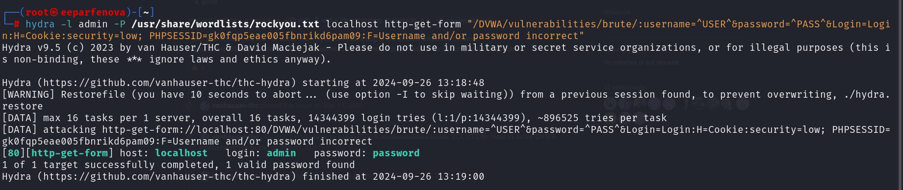
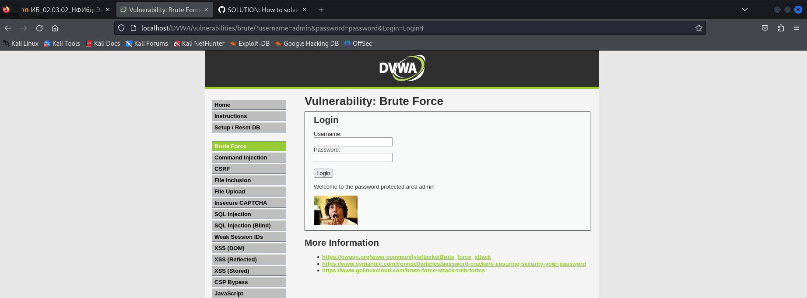

---
## Front matter
lang: ru-RU
title: Индивидуальный проект. 3 этап
subtitle: Использование Hydra
author:
  - Парфенова Е. Е.
teacher:
  - Кулябов Д. С.
  - д.ф.-м.н., профессор
  - профессор кафедры прикладной информатики и теории вероятностей
institute:
  - Российский университет дружбы народов, Москва, Россия
date: 27 сентября 2024

## i18n babel
babel-lang: russian
babel-otherlangs: english

## Formatting pdf
toc: false
toc-title: Содержание
slide_level: 2
aspectratio: 169
section-titles: true
theme: metropolis
header-includes:
 - \metroset{progressbar=frametitle,sectionpage=progressbar,numbering=fraction}
---

# Информация

## Докладчик

:::::::::::::: {.columns align=center}
::: {.column width="70%"}

  * Парфенова Елизавета Евгеньвена
  * студент
  * Российский университет дружбы народов
  * [1032216437@pfur.ru](mailto:1032216437@pfur.ru)
  * <https://github.com/parfenovaee>

:::
::: {.column width="30%"}

:::
::::::::::::::

# Вводная часть

## Актуальность

Возможность научиться взаимодействовать с Hydra на простых задачах для дальнейшего использования этого инструмента в некоторых областях для настраивания качественной защиты своих онлайн-сервисов, веб-приложений и тд. 

## Цели и задачи

**Цель**: Получение практических навыков использования Hydra для подбора пароля

**Задачи**: Подобрать пароль с помощью Hydra

# Теоретическое введение 

## Теоретичсекое введение(1)

**Damn Vulnerable Web Application (DVWA)** — это веб-приложение на PHP/MySQL, которое очень сильно уязвимо. 

## Теоретичсекое введение(2)

В третьем этапе проекта мы будем использовать уязвимость Брутфорс. 

**Brute force** - это метод проб и ошибок, заключающийся в многократном опробовании задачи, каждый раз последовательно изменяя значение, пока не будет достигнут определенный результат. Таким образом, он прокладывает себе путь и не принимает "нет" в качестве ответа. 

## Теоретичсекое введение(3)

Также подбор пароля не может обойтись без Hydra. 

**Hydra** - это программное обеспечение с открытым исходным кодом для перебора паролей в реальном времени от различных онлайн сервисов, веб-приложений, FTP, SSH и других протоколов. 

# Выполнение третьего этапа проекта

## Устанвока уровня безопасности

{#fig:001 width=70%}

## Уязвимость Brute force

{#fig:002 width=70%}

## Распаковка файла rockyou.txt.gz

{#fig:003 width=70%}

## Прочтение файла rockyou.txt

{#fig:004 width=70%}

## Извлечение нужных данных запроса

{#fig:005 width=80%}

## Извлечение нужных данных запроса

{#fig:006 width=80%}

## Запрос к Hydra

{#fig:007 width=70%}

## Успешный вход

{#fig:008 width=70%}

# Вывод

## Выводы 

Мы получили практические навыки использования Hydra для подбора пароля c помощью атаки типа brute force

