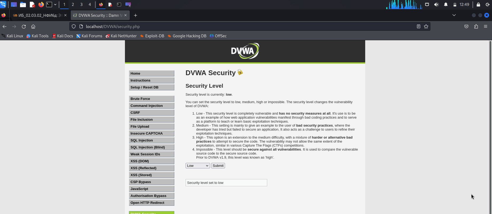
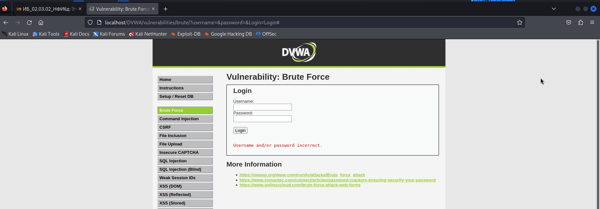
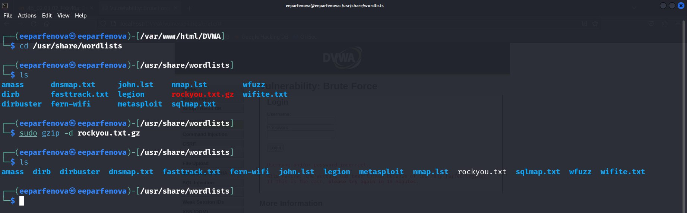
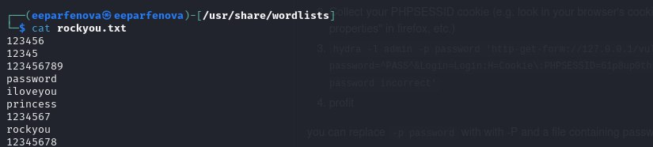
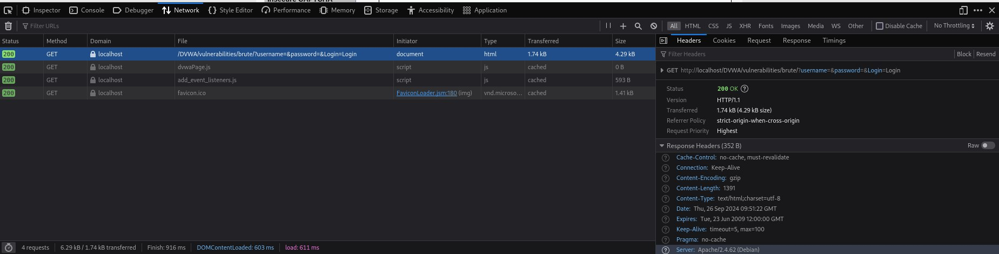
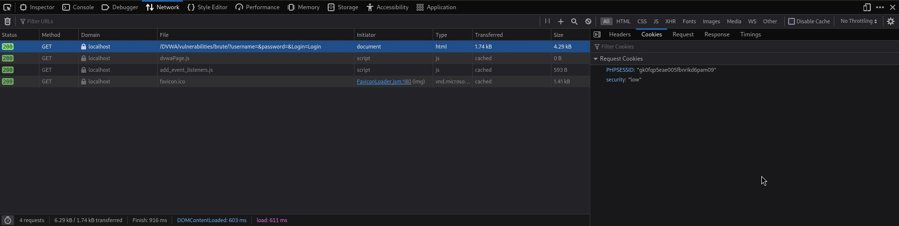
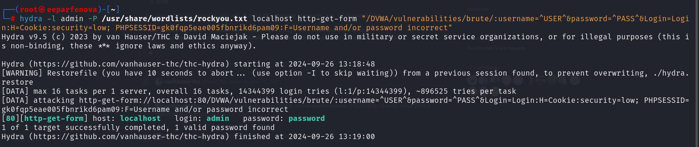
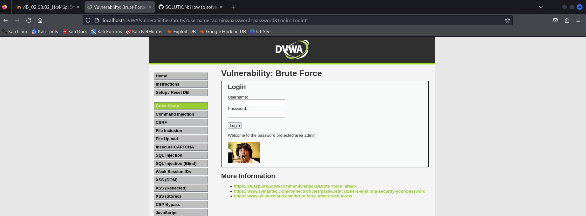

---
## Front matter
title: "Индивидуальный проект. 3 этап"
subtitle: "Использование Hydra"
author: "Парфенова Елизавета Евгеньевна"

## Generic otions
lang: ru-RU
toc-title: "Содержание"

## Bibliography
bibliography: bib/cite.bib
csl: pandoc/csl/gost-r-7-0-5-2008-numeric.csl

## Pdf output format
toc: true # Table of contents
toc-depth: 2
lof: true # List of figures
lot: true # List of tables
fontsize: 12pt
linestretch: 1.5
papersize: a4
documentclass: scrreprt
## I18n polyglossia
polyglossia-lang:
  name: russian
  options:
	- spelling=modern
	- babelshorthands=true
polyglossia-otherlangs:
  name: english
## I18n babel
babel-lang: russian
babel-otherlangs: english
## Fonts
mainfont: IBM Plex Serif
romanfont: IBM Plex Serif
sansfont: IBM Plex Sans
monofont: IBM Plex Mono
mathfont: STIX Two Math
mainfontoptions: Ligatures=Common,Ligatures=TeX,Scale=0.94
romanfontoptions: Ligatures=Common,Ligatures=TeX,Scale=0.94
sansfontoptions: Ligatures=Common,Ligatures=TeX,Scale=MatchLowercase,Scale=0.94
monofontoptions: Scale=MatchLowercase,Scale=0.94,FakeStretch=0.9
mathfontoptions:
## Biblatex
biblatex: true
biblio-style: "gost-numeric"
biblatexoptions:
  - parentracker=true
  - backend=biber
  - hyperref=auto
  - language=auto
  - autolang=other*
  - citestyle=gost-numeric
## Pandoc-crossref LaTeX customization
figureTitle: "Рис."
tableTitle: "Таблица"
listingTitle: "Листинг"
lofTitle: "Список иллюстраций"
lotTitle: "Список таблиц"
lolTitle: "Листинги"
## Misc options
indent: true
header-includes:
  - \usepackage{indentfirst}
  - \usepackage{float} # keep figures where there are in the text
  - \floatplacement{figure}{H} # keep figures where there are in the text
---

# Цель работы

Получение практических навыков использования Hydra для подбора пароля

# Теоретическое введение

**Damn Vulnerable Web Application (DVWA)** — это веб-приложение на PHP/MySQL, которое очень сильно уязвимо. Его главная цель — помочь профессионалам по безопасности протестировать их навыки и инструменты в легальном окружении, помочь веб-разработчикам лучше понять процесс безопасности веб-приложений и помочь и студентам и учителям в изучении безопасности веб-приложений в контролируем окружении аудитории. [@dvwa:bash]

Некоторые из уязвимостей веб приложений, который содержит DVWA:

- *Брутфорс*: Брутфорс HTTP формы страницы входа - используется для тестирования инструментов по атаке на пароль методом грубой силы и показывает небезопасность слабых паролей.
- *Исполнение (внедрение) команд*: Выполнение команд уровня операционной системы.
- *Межсайтовая подделка запроса (CSRF)*: Позволяет «атакующему» изменить пароль администратора приложений.
- *Внедрение (инклуд) файлов*: Позволяет «атакующему» присоединить удалённые/локальные файлы в веб приложение.
- *SQL внедрение*: Позволяет «атакующему» внедрить SQL выражения в HTTP из поля ввода, DVWA включает слепое и основанное на ошибке SQL внедрение.
- *Небезопасная выгрузка файлов*: Позволяет «атакующему» выгрузить вредоносные файлы на веб сервер.
- *Межсайтовый скриптинг (XSS)*: «Атакующий» может внедрить свои скрипты в веб приложение/базу данных. DVWA включает отражённую и хранимую XSS.
- *Пасхальные яйца*: раскрытие полных путей, обход аутентификации и некоторые другие.

В третьем этапе проекта мы будем использовать Брутфорс. 

**Brute force** - это метод проб и ошибок, заключающийся в многократном опробовании задачи, каждый раз последовательно изменяя значение, пока не будет достигнут определенный результат. Таким образом, он прокладывает себе путь и не принимает "нет" в качестве ответа. [@bf:bash]

DVWA имеет несколько уровней безопасности, они меняют уровень безопасности каждого веб приложения в DVWA:

- *Невозможный* — этот уровень должен быть безопасным от всех уязвимостей. Он используется для сравнения уязвимого исходного кода с безопасным исходным кодом.
- *Высокий* — это расширение среднего уровня сложности, со смесью более сложных или альтернативных плохих практик в попытке обезопасить код. Уязвимости не позволяют такой простор эксплуатации как на других уровнях.
- *Средний* — этот уровень безопасности предназначен главным образом для того, чтобы дать пользователю пример плохих практик безопасности, где разработчик попытался сделать приложение безопасным, но потерпел неудачу.
- *Низкий* — этот уровень безопасности совершенно уязвим и совсем не имеет защиты. Его предназначение быть примером среди уязвимых веб приложений, примером плохих практик программирования и служить платформой обучения базовым техникам эксплуатации.

В третьем этапе проекта будем пробовать подбирать пароль на низком уровне безопасности. Также подбор пароля не может обойтись без Hydra. 

**Hydra** - это программное обеспечение с открытым исходным кодом для перебора паролей в реальном времени от различных онлайн сервисов, веб-приложений, FTP, SSH и других протоколов. Особенность инструмента в том, что здесь выполняется перебор не по хэшу, а напрямую с помощью запросов к серверу, это значит что вы сможете проверить правильно ли настроены фаерволы,  блокируются ли такие попытки, а также можете ли вы вообще определить такую атаку на сервер. [@hydra:bash]

# Выполнение этапа проекта

Установим самый низкий уровень безопасности DVWA на странице *DVWA Security* (уровень low) (рис. [-@fig:001]).

{#fig:001 width=70%}

Зайдем на страницу *Brute force*, на которой мы будем осуществлять подбор пароля. Предположим, что мы не знаем пароль и введем какой-то случайный. Видим, что пароль не был принят, а на экране высветилось предупреждение "Username and/or password incorrect" (рис. [-@fig:002]).

{#fig:002 width=70%}

Найдем в системе Kali Linux запакованный файл rockyou.txt.gz, в котором хрантся возможные пароли. Его путь: */usr/share/wordlists*. Распакуем данный файл командой *sudo gzip -d rockyou.txt.gz* (рис. [-@fig:003]) и проверим, что в нем находится (прочитаем) командой *cat rockyou.txt*. В файле записаны очень много всевозможных паролей, видим, что правильный пароль находится практически в сам начале файла. (рис. [-@fig:004])

{#fig:003 width=70%}

{#fig:004 width=70%}

Для того, чтобы правильно написать команду в Hydra мы должны узнать некоторые данные о запросе. На странице ввода данных нажимаем комбинацию клавиш *Ctrl+Shift+i* и открывается панель, в которой, нажав еще раз на запрос *login*, мы можем следующие данные: (рис. [-@fig:005]) (рис. [-@fig:006]) 

- IP сервера: 127.0.0.1 (localhost)
- Сервис http на стандартном 80 порту;
- Для авторизации используется html форма, которая отправляет по адресу http://localhost/DVWA/vulnerabilities/brute методом GET запрос вида username=admin&password=test_password;
- В случае не удачной аутентификации пользователь наблюдает сообщение Username and/or password incorrect
- PHPSESSID "gk0fqp5eae005fbnrikd6pam09" (во вкладке Cookies)
- security "low" (во вкладке Cookies)

{#fig:005 width=70%}

{#fig:006 width=70%}

Теперь мы можем написать запрос к Hydra от имени суперпользователя, он будет выглядеть следующим образом (рис. [-@fig:007]) 

{#fig:007 width=70%}

Видим, что в конце концов Hyfra вывела правильный пароль (он вместе с некоторыми другими данными подсвечер голубым цветом), им является "password".

Теперь попробуем ввести найденные данные и проверить, выполнится ли вход на страничке Brute force. (рис. [-@fig:008]). Как видим, вход произошел успешно, а значит пароль подобран правильно. 

{#fig:008 width=70%}

# Выводы

Мы получили практические навыки использования Hydra для подбора пароля c помощью атаки типа brute force

# Список литературы{.unnumbered}

::: {#refs}
:::
