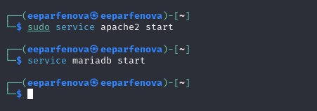
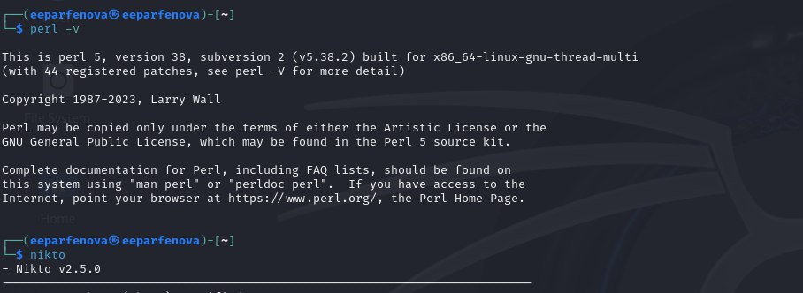
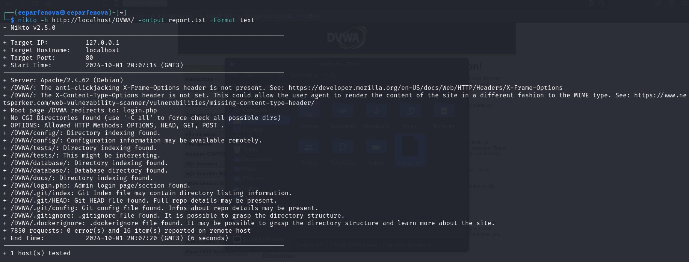
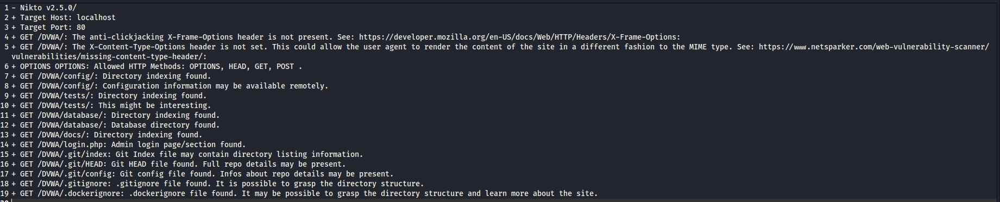
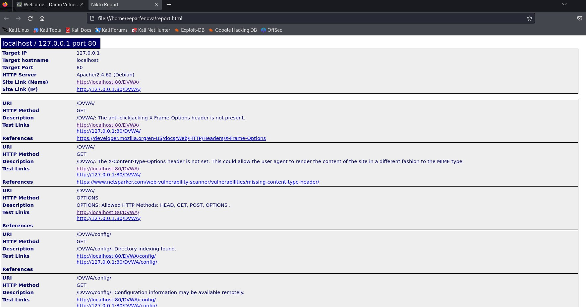
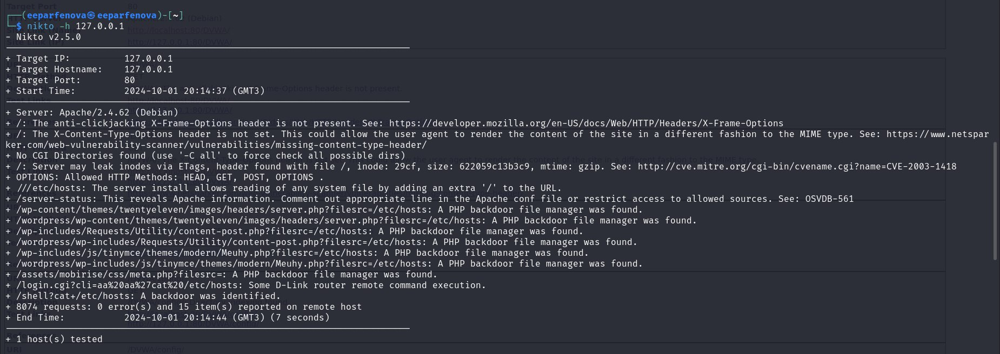
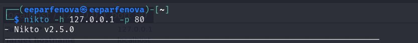

---
## Front matter
lang: ru-RU
title: Индивидуальный проект. Этап 4
subtitle: Использование nikto
author:
  - Парфенова Е. Е.
teacher:
  - Кулябов Д. С.
  - д.ф.-м.н., профессор
  - профессор кафедры прикладной информатики и теории вероятностей
institute:
  - Российский университет дружбы народов, Москва, Россия
date: 3 октября 2024

## i18n babel
babel-lang: russian
babel-otherlangs: english

## Formatting pdf
toc: false
toc-title: Содержание
slide_level: 2
aspectratio: 169
section-titles: true
theme: metropolis
header-includes:
 - \metroset{progressbar=frametitle,sectionpage=progressbar,numbering=fraction}
---

# Информация

## Докладчик

:::::::::::::: {.columns align=center}
::: {.column width="70%"}

  * Парфенова Елизавета Евгеньвена
  * студент
  * Российский университет дружбы народов
  * [1032216437@pfur.ru](mailto:1032216437@pfur.ru)
  * <https://github.com/parfenovaee>

:::
::: {.column width="30%"}

:::
::::::::::::::

# Вводная часть

## Актуальность

Важность наличия умения сканировать различные веб-приложения на уязвимости с целью их устранения

## Цели и задачи

**Цель**: Использование веб-сканера Nikto для сканирования уязвимостей веб-приложений

**Задачи**: Использовать Nikto для сканирования DVWA

# Теоретическое введение 

## Теоретичсекое введение(1)

**Nikto** – веб-сканер, проверяющий веб-серверы на самые частые ошибки, возникающие обычно из-за человеческого фактора. Проверяет целевой веб-сервер на наличие опасных файлов и исполняемых сценариев, инструментов администрирования базами данных, устаревшего программного обеспечения.

## Теоретичсекое введение(2)

Он является бесплатным (open source) сканером. Утилита относиться к классу blackbox сканеров. Программа может обнаруживать более 6700 потенциально опасных файлов и уязвимостей. Новые уязвимости добавляются в базу данных программы по мере их возникновения. 

При сканировании сайта в логах сайта или в любой другой системе обнаружения вторжений, если Nikto используется, будет отображена информация о том, что сайт подвергается сканированию.

## Теоретичсекое введение(3)

Cреди функций Nikto можно выделить следующие:

- поддержка SSL
- поддержка HTTP прокси
- создание отчетов в текстовом формате, XML, HTML, NBE или CSV
- возможность сканирования портов
- поиск поддоменов
- поддержка плагинов для расширения функционала сканирования

# Выполнение четвертого этапа проекта

## Запуск веб-приложения DVWA

{#fig:001 width=70%}

## Наличие Nikto

{#fig:002 width=70%}

## Сканирование DVWA. URL

{#fig:003 width=70%}

## Сканирование DVWA. URL

:::::::::::::: {.columns align=center}
::: {.column width="50%"}

{#fig:004 width=80%}

:::
::: {.column width="50%"}

{#fig:005 width=80%}

:::
::::::::::::::

## Сканирование DVWA. URL

В результате сканирования было найдено 16 уязвимостей. В них входят: 

- Отсутствие заголовка X-Frame-Options и X-Content-Type-Options
- Обнаружена индексация каталогов в /DVWA/config/, /DVWA/tests/, /DVWA/database/ и т.д.
- Найдены страницы для входа в административную панель и конфигурационные файлы Git (скрытая папка Git), которые могут содержать важную информацию о структуре проекта (сайта) и репозитории.

## Сканирование. IP

{#fig:006 width=70%}

## Сканирование. IP c портом

{#fig:007 width=70%}

## Сканирование. IP

При таком сканировании было найдено 15 уязвимостей

- Утечка информации о файловой системе через ETags
- Уязвимость чтения системных файлов с помощью манипуляций с URL
- PHP Backdoor file manager был обнаружен в нескольких местах
- Уязвимость удаленного выполнения команд на роутерах D-Link.

# Вывод

## Выводы 

Мы использовали веб-сканера Nikto для сканирования уязвимостей веб-приложений, а конкретно для сканирования DVWA

