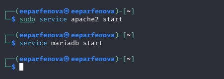
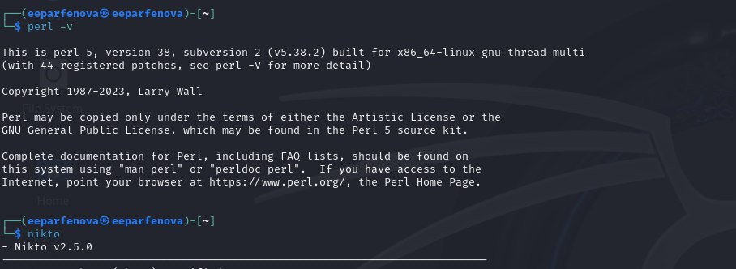
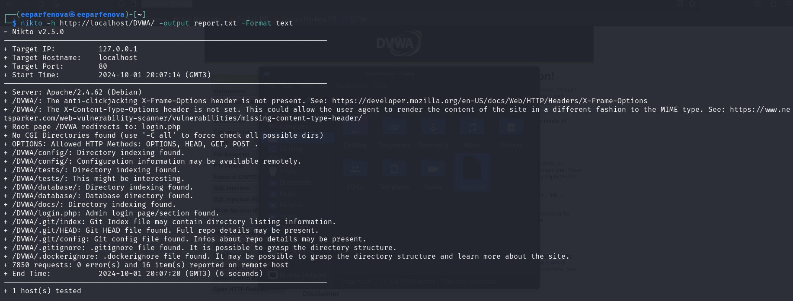
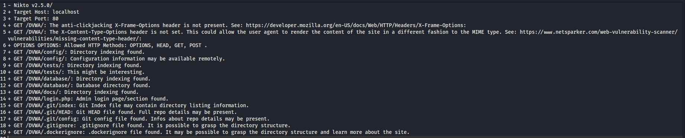
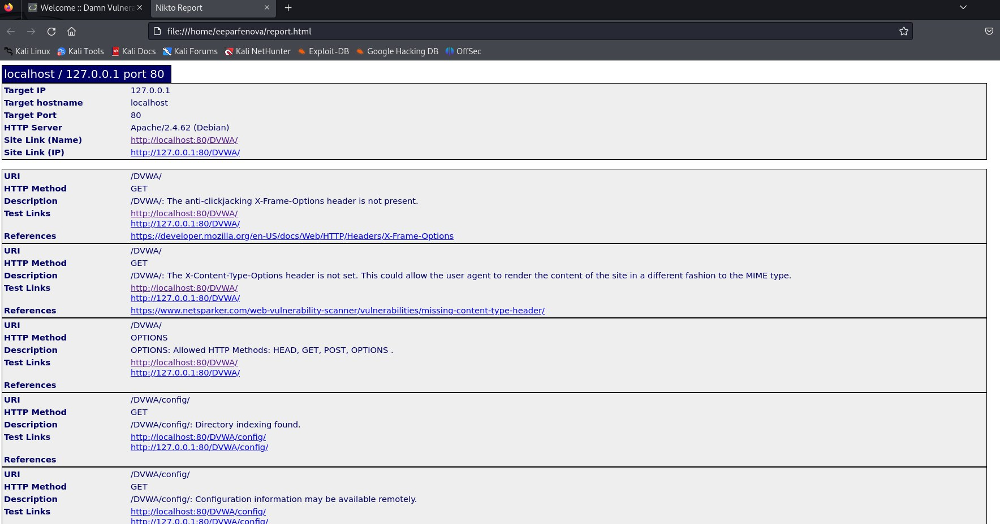
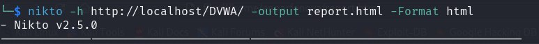
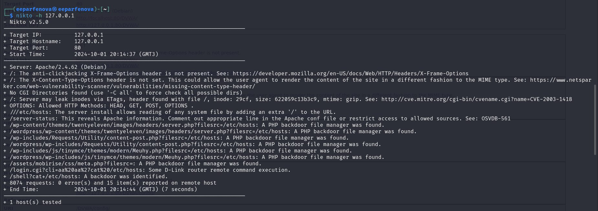
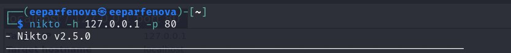

---
## Front matter
title: "Индивидуальный проект. Этап 4"
subtitle: "Использование nikto"
author: "Парфенова Елизавета Евгеньевна"

## Generic otions
lang: ru-RU
toc-title: "Содержание"

## Bibliography
bibliography: bib/cite.bib
csl: pandoc/csl/gost-r-7-0-5-2008-numeric.csl

## Pdf output format
toc: true # Table of contents
toc-depth: 2
lof: true # List of figures
lot: true # List of tables
fontsize: 12pt
linestretch: 1.5
papersize: a4
documentclass: scrreprt
## I18n polyglossia
polyglossia-lang:
  name: russian
  options:
	- spelling=modern
	- babelshorthands=true
polyglossia-otherlangs:
  name: english
## I18n babel
babel-lang: russian
babel-otherlangs: english
## Fonts
mainfont: IBM Plex Serif
romanfont: IBM Plex Serif
sansfont: IBM Plex Sans
monofont: IBM Plex Mono
mathfont: STIX Two Math
mainfontoptions: Ligatures=Common,Ligatures=TeX,Scale=0.94
romanfontoptions: Ligatures=Common,Ligatures=TeX,Scale=0.94
sansfontoptions: Ligatures=Common,Ligatures=TeX,Scale=MatchLowercase,Scale=0.94
monofontoptions: Scale=MatchLowercase,Scale=0.94,FakeStretch=0.9
mathfontoptions:
## Biblatex
biblatex: true
biblio-style: "gost-numeric"
biblatexoptions:
  - parentracker=true
  - backend=biber
  - hyperref=auto
  - language=auto
  - autolang=other*
  - citestyle=gost-numeric
## Pandoc-crossref LaTeX customization
figureTitle: "Рис."
tableTitle: "Таблица"
listingTitle: "Листинг"
lofTitle: "Список иллюстраций"
lotTitle: "Список таблиц"
lolTitle: "Листинги"
## Misc options
indent: true
header-includes:
  - \usepackage{indentfirst}
  - \usepackage{float} # keep figures where there are in the text
  - \floatplacement{figure}{H} # keep figures where there are in the text
---

# Цель работы

Использование веб-сканера Nikto для сканирования уязвимостей веб-приложений.

# Теоретическое введение

**Nikto** – веб-сканер, проверяющий веб-серверы на самые частые ошибки, возникающие обычно из-за человеческого фактора. Проверяет целевой веб-сервер на наличие опасных файлов и исполняемых сценариев, инструментов администрирования базами данных, устаревшего программного обеспечения. [@wiki:bash]

 Он является бесплатным (open source) сканером. Утилита относиться к классу blackbox сканеров, т. е. сканеров, использующих стратегию сканирования методом черного ящика. Это значит, что заранее неизвестно о внутреннем устройстве программы/сайта (доступ к исходному коду отсутствует) и упор сделан на функциональность. Программа может обнаруживать более 6700 потенциально опасных файлов и уязвимостей. Новые уязвимости добавляются в базу данных программы по мере их возникновения. Nikto не позиционируется как стелс сканер (стелс сканеры никогда не устанавливают TCP-соединения до конца, тем самым сканирование происходит скрытно) – при сканировании сайта в логах сайта или в любой другой системе обнаружения вторжений, если она используется, будет отображена информация о том, что сайт подвергается сканированию.

Первая версия Nikto под номером 1.00 была создана в 2001 году Американским инженером по информационной безопасности Крисом Сулло. На момент 2023 года последней актуальной версией является версия 2.1.6.

Среди функций Nikto можно выделить следующие:

- поддержка SSL,

- поддержка HTTP прокси;

- создание отчетов в текстовом формате, XML, HTML, NBE или CSV;

- возможность сканирования портов;

- поиск поддоменов;

- поддержка плагинов для расширения функционала сканирования. [@nikto:bash]

# Выполнение этапа проекта

Для того, чтобы просканировать веб-приложение DVWA нам необходимо запустить его. Для этого мы запускаем сервер apache2 и базу данных с помощью команд *sudo service apashe2 start* и *service mariadb start* (рис. [-@fig:001]).

{#fig:001 width=70%}

Проверим наличие perl и nikto в нашей системе. Для этого последовательно введем команды *perl -v* и *nikto*. perl, по информации с источника [@nikto:bash], обязательно должен быть установлен перед nikto. В тоге, видим, что и то, и другое установлено в Linux (рис. [-@fig:002]).

{#fig:002 width=70%}

Запрос в Nikto можно сделать через URL и через IP (с портом). В первом случае команда будет выглядеть следующим образом *nikto -h http://localhost/DVWA/ -output report.txt - Format text*. (рис. [-@fig:003]) Все что следует после опции output используется дополнительно для отчетов разных форматов. Я попробовала создать отчеты в текстовом формате (рис. [-@fig:004]) и в формате html (рис. [-@fig:005]). Для отчета в формате html команда немного изменится и будет выглядеть следующим образом (рис. [-@fig:006]). (В обоих вариантах report.txt(.html) - название файла, в котором отчет будет сохранен)

{#fig:003 width=70%}

{#fig:004 width=70%}

{#fig:005 width=70%}

{#fig:006 width=70%}

Итак, в результате сканирования было найдено 16 уязвимостей. В них входят: 

- Отсутствие заголовка X-Frame-Options, что делает сайт уязвимым для атак типа clickjacking
- Отсутствие заголовка X-Content-Type-Options, что может позволить браузеру обрабатывать содержимое некорректно, не того MIME-типа, который был определен и не должен быть изменен
- Обнаружена индексация каталогов в /DVWA/config/, /DVWA/tests/, /DVWA/database/ и т.д., что может позволить доступ к конфиденциальной информации
- Найдены страницы для входа в административную панель и конфигурационные файлы Git (скрытая папка Git), которые могут содержать важную информацию о структуре проекта (сайта) и репозитории

Также было указано, что доступны 4 метода HTTP: OPTIONS, GET, POST, HEAD.

Во втором случае, сканирование будет выглядеть следующим образом (рис. [-@fig:007]). При этом вывод команд *nikto -h 127.0.0.1* и *nikto -h 127.0.0.1 -p 80* (указание порта локального хоста) (рис. [-@fig:008]) идентичен 

{#fig:007 width=70%}

{#fig:008 width=70%}

При таком сканировании было найдено 15 уязвимостей. Помимо похожих с предыдущим случаем уязвимостей, были найдены:

- Утечка информации о файловой системе через ETags
- Уязвимость чтения системных файлов с помощью манипуляций с URL (/etc/hosts)
- PHP Backdoor file manager был обнаружен в нескольких местах, что свидетельствует о возможной зараженности системы бэкдором
- Уязвимость удаленного выполнения команд на роутерах D-Link

# Выводы

Мы использовали веб-сканера Nikto для сканирования уязвимостей веб-приложений. 

# Список литературы{.unnumbered}

::: {#refs}
:::
