---
## Front matter
lang: ru-RU
title: Индивидуальный проект. Этап 5
subtitle: Использования Burp Suite
author:
  - Парфенова Е. Е.
teacher:
  - Кулябов Д. С.
  - д.ф.-м.н., профессор
  - профессор кафедры прикладной информатики и теории вероятностей
institute:
  - Российский университет дружбы народов, Москва, Россия
date: 12 октября 2024

## i18n babel
babel-lang: russian
babel-otherlangs: english

## Formatting pdf
toc: false
toc-title: Содержание
slide_level: 2
aspectratio: 169
section-titles: true
theme: metropolis
header-includes:
 - \metroset{progressbar=frametitle,sectionpage=progressbar,numbering=fraction}
---

# Информация

## Докладчик

:::::::::::::: {.columns align=center}
::: {.column width="70%"}

  * Парфенова Елизавета Евгеньвена
  * студент
  * Российский университет дружбы народов
  * [1032216437@pfur.ru](mailto:1032216437@pfur.ru)
  * <https://github.com/parfenovaee>

:::
::: {.column width="30%"}

:::
::::::::::::::

# Вводная часть

## Актуальность

Важность понимания, как происходит перехват http-запросов, для поднятия уровня безопасности используемых систем, веб-сайтов и так далее

## Цели и задачи

**Цель**: Обретение практических навыков использования Burp Suite

**Задачи**: 

- Осуществить перехват запроса для веб-сервера DVWA 
- Перехватить запрос аутентификации, попробовав изменить передаваемые данные

# Теоретическое введение 

## Теоретичсекое введение(1)

**Burp Suite** – это мультитул для проведения аудита безопасности веб-приложений. Содержит инструменты для составления карты веб-приложения, поиска файлов и папок, модификации запросов, фаззинга, подбора паролей и многое другое. Сам инструмент представляет из себя проксирующий механизм, перехватывающий и обрабатывающий все поступающие от браузера запросы.

## Теоретичсекое введение(2)

Основные модули:

:::::::::::::: {.columns align=center}
::: {.column width="50%"}

- Proxy 
- Spider  
- Scanner 
- Intruder 

:::
::: {.column width="50%"}

- Repeater 
- Sequencer 
- Decoder 
- Comparer 
- Extender 

:::
::::::::::::::

# Выполнение пятого этапа проекта

## Запуск сервера и открытие Burp Suite

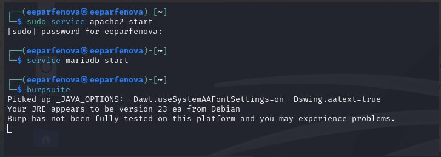{#fig:001 width=70%}

## Проект Burp Suite

:::::::::::::: {.columns align=center}
::: {.column width="50%"}

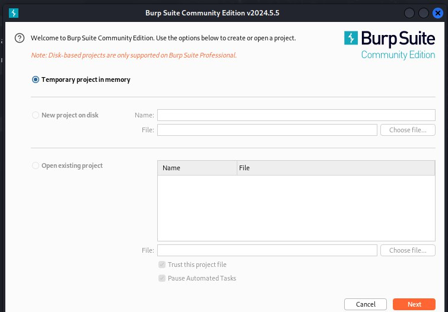{#fig:002 width=70%}

:::
::: {.column width="50%"}

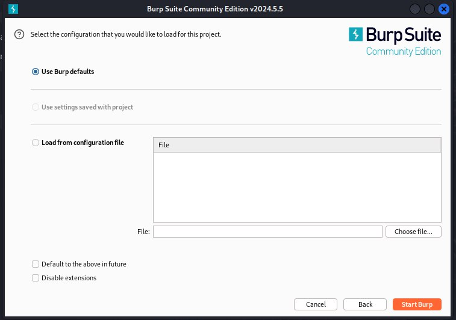{#fig:003 width=70%}

:::
::::::::::::::

## Запуск перехвата

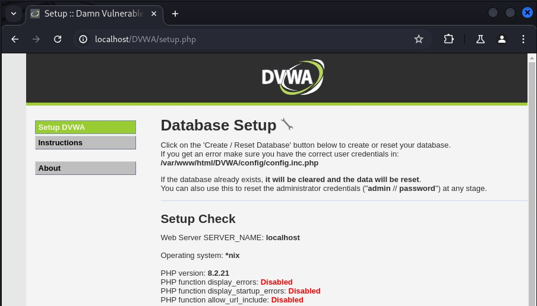{#fig:004 width=40%}

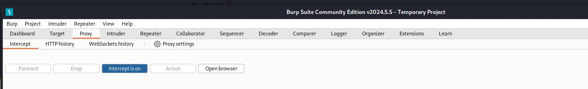{#fig:005 width=60%}

## Перехват запроса

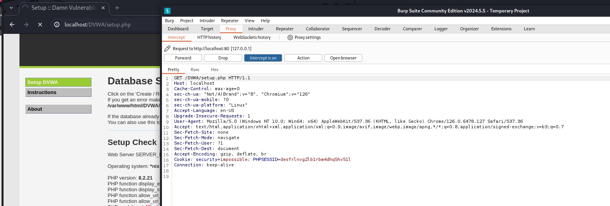{#fig:006 width=70%}

## Перехват запроса авторизации

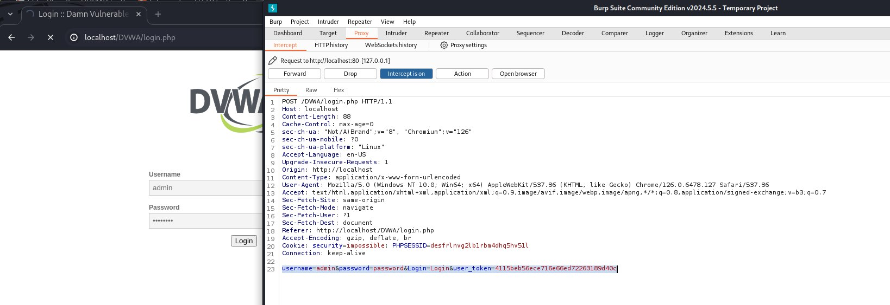{#fig:007 width=70%}

## История запросов

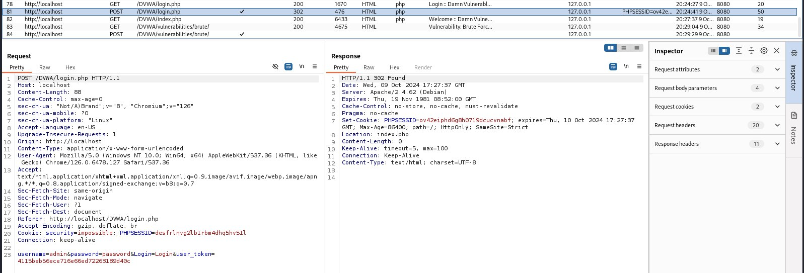{#fig:008 width=70%}

## Изменение данных перехваченного запроса

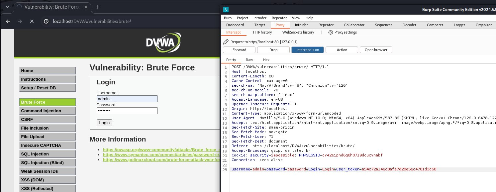{#fig:009 width=70%}

## Изменение данных перехваченного запроса

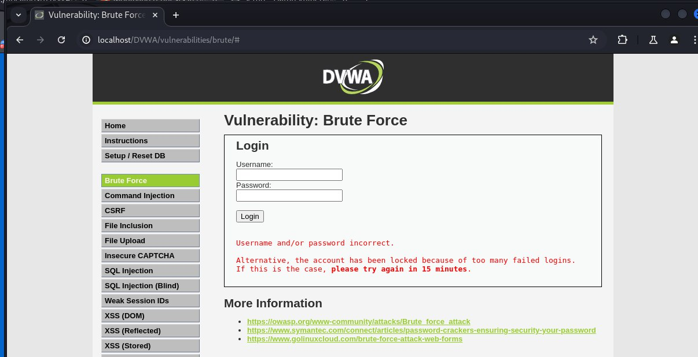{#fig:010 width=40%}

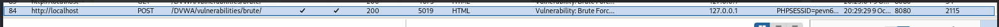{#fig:011 width=70%}

# Вывод

## Выводы

Мы обрели практические навыки использования Burp Suite, осуществив перехват запроса для веб-сервера DVWA и перехватив запрос аутентификации с изменением его данных

