---
## Front matter
title: "Индивидуальный проект. Этап 5"
subtitle: "Использования Burp Suite"
author: "Парфенова Елизавета Евгеньевна"

## Generic otions
lang: ru-RU
toc-title: "Содержание"

## Bibliography
bibliography: bib/cite.bib
csl: pandoc/csl/gost-r-7-0-5-2008-numeric.csl

## Pdf output format
toc: true # Table of contents
toc-depth: 2
lof: true # List of figures
lot: true # List of tables
fontsize: 12pt
linestretch: 1.5
papersize: a4
documentclass: scrreprt
## I18n polyglossia
polyglossia-lang:
  name: russian
  options:
	- spelling=modern
	- babelshorthands=true
polyglossia-otherlangs:
  name: english
## I18n babel
babel-lang: russian
babel-otherlangs: english
## Fonts
mainfont: IBM Plex Serif
romanfont: IBM Plex Serif
sansfont: IBM Plex Sans
monofont: IBM Plex Mono
mathfont: STIX Two Math
mainfontoptions: Ligatures=Common,Ligatures=TeX,Scale=0.94
romanfontoptions: Ligatures=Common,Ligatures=TeX,Scale=0.94
sansfontoptions: Ligatures=Common,Ligatures=TeX,Scale=MatchLowercase,Scale=0.94
monofontoptions: Scale=MatchLowercase,Scale=0.94,FakeStretch=0.9
mathfontoptions:
## Biblatex
biblatex: true
biblio-style: "gost-numeric"
biblatexoptions:
  - parentracker=true
  - backend=biber
  - hyperref=auto
  - language=auto
  - autolang=other*
  - citestyle=gost-numeric
## Pandoc-crossref LaTeX customization
figureTitle: "Рис."
tableTitle: "Таблица"
listingTitle: "Листинг"
lofTitle: "Список иллюстраций"
lotTitle: "Список таблиц"
lolTitle: "Листинги"
## Misc options
indent: true
header-includes:
  - \usepackage{indentfirst}
  - \usepackage{float} # keep figures where there are in the text
  - \floatplacement{figure}{H} # keep figures where there are in the text
---

# Цель работы

Обретение практических навыков использования Burp Suite

# Задание

- Осуществить перехват запроса для веб-сервера DVWA 
- Перехватить запрос аутентификации, попробовав изменить передаваемые данные

# Теоретическое введение

**Burp Suite** – это мультитул для проведения аудита безопасности веб-приложений. Содержит инструменты для составления карты веб-приложения, поиска файлов и папок, модификации запросов, 
фаззинга, подбора паролей и многое другое. Также существует магазин дополнений BApp store, содержащий дополнительные расширения, увеличивающие функционал приложения. Burp Suite — это 
интегрированная платформа, предназначенная для проведения аудита веб-приложения, как в ручном, так и в автоматических режимах. Содержит интуитивно понятный интерфейс со специально 
спроектированными табами, позволяющими улучшить и ускорить процесс атаки. Сам инструмент представляет из себя проксирующий механизм, перехватывающий и обрабатывающий все поступающие от 
браузера запросы. Имеется возможность установки сертификата burp для анализа https соединений.

Основной функционал основан на следующих модулях:

- Proxy — перехватывающий прокси-сервер, работающий по протоколу HTTP(S) в режиме man-in-the-middle. Находясь между браузером и веб-приложением он позволит вам перехватывать, изучать и изменять трафик идущий в обоих направлениях.
- Spider — паук или краулер, позволяющий вам в автоматическом режиме собирать информацию о об архитектуре веб-приложения.
- Scanner — автоматический сканер уязвимостей ( OWASP TOP 10 и т.д.) Доступен в Professional версии, в бесплатной версии только описание возможностей.
- Intruder — утилита, позволяющая в автоматическом режиме производить атаки различного вида, такие как подбор пароля, перебор идентификаторов, фаззинг и так далее.
- Repeater — утилита для модифицирования и повторной отправки отдельных HTTP-запросов и анализа ответов приложения.
- Sequencer — утилита для анализа генерации случайных данных приложения, выявления алгоритма генерации, предиктивности данных.
- Decoder — утилита для ручного или автоматического преобразования данных веб-приложения.
- Comparer — утилита для выявления различий в данных.
- Extender — расширения в BurpSuite. Можно добавлять как готовые из BApp store, так и собственной разработки [@bs:bash].

# Выполнение лабораторной работы

Для дальнейшей работы с DVWA запустим сервер и базу данных, а также запустим сам Burp Suite, который изначально был установлен в моей ОС. (рис. [-@fig:001]).

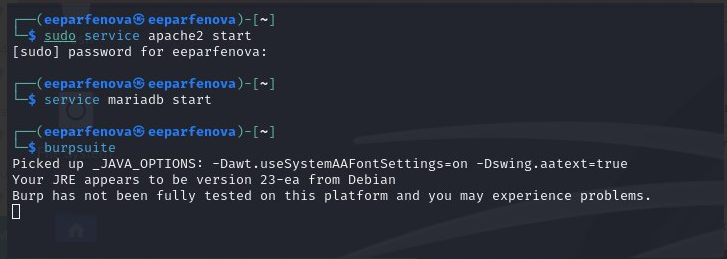{#fig:001 width=70%}

Далее создадим временный проект в Burp Suite (рис. [-@fig:002]) с дефолтными Burp настройками (рис. [-@fig:003]). 

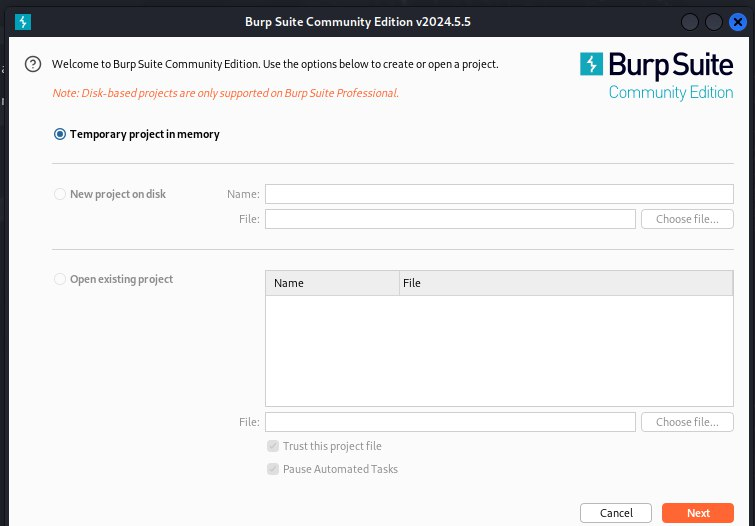{#fig:002 width=70%}

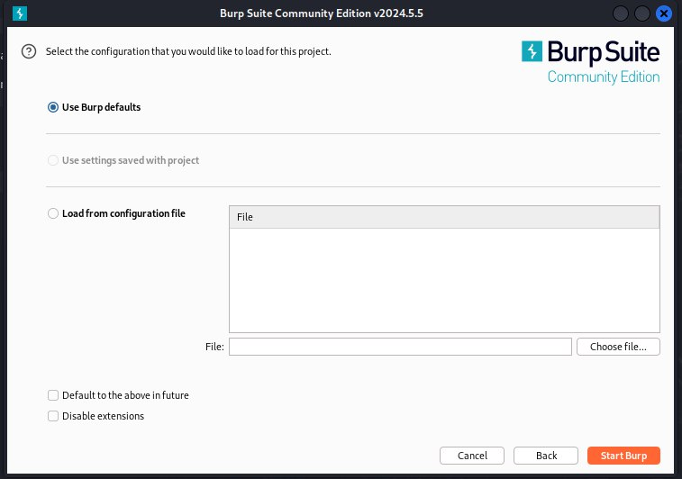{#fig:003 width=70%}

Зайдем в DVWA через привычный запрос "http://localhost/DVWA/setup.php", но сделаем это именно через Burp-браузер, нажав на кнопку "Open browser" во вкладке Proxy самого приложения (рис. [-@fig:004])

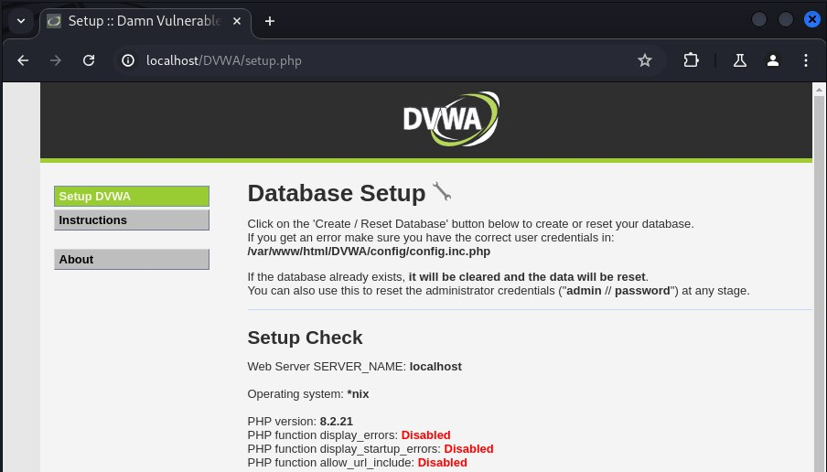{#fig:004 width=70%}

Затем в той же вкладке тапнем на кнопку "Intercepr is off", переведя ее в активное состояние "Intercepr is on" (рис. [-@fig:005]), и перезагрузим открытый веб-сайт (сайт не перезагрузится, пока мы не пустим запрос дальше). Видим, что мы перехватили http-запрос и теперь можем посмотреть всю информацию о нем (рис. [-@fig:006]). Здесь можно увидеть информацию о методе запроса, адресе запроса, имени хоста, уровне бзопасности сайта, данные cookie.

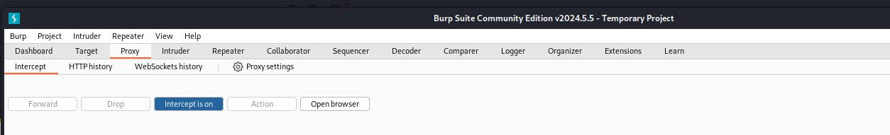{#fig:005 width=70%}

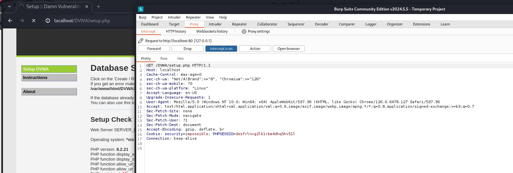{#fig:006 width=70%}

Попробуем авторизоваться, перехватив этот запрос и данные для авторизации соответственно. Видим, что помимо уже знакомых нам данных (метод запроса на этот раз POST), мы перехватили также пароль и логин (рис. [-@fig:007]). Во вкладке HTTP History можно посмотреть полную историю запросов, найдем там наш запрос и увидим еще более подробную информацию + ответ от сервера на наш запрос в правой стороне и данные о нем. (рис. [-@fig:008])

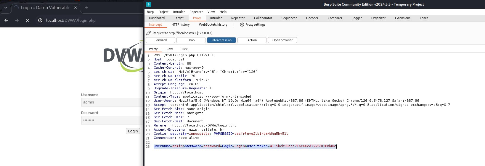{#fig:007 width=70%}

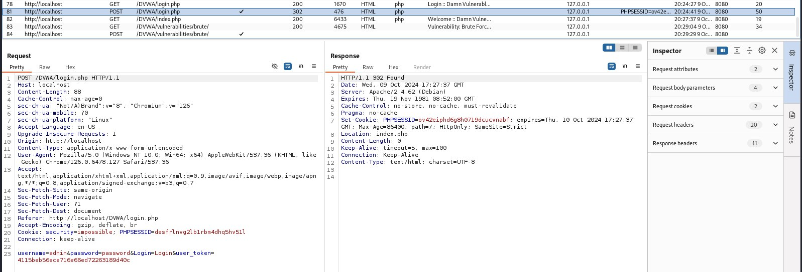{#fig:008 width=70%}

Попробуем перехватить данные об авторизации и изменить их. Для этого зайдем в уже знакомую нам вкладку Brute Force и попробуем ввести данные авторизации там, попутно перехватывая этот запрос через Burp Suite. Видим, что в перехваченном запросе все также есть логин и пароль (рис. [-@fig:009]). Попробуем заменить пароль на pasw в перехваченном запросе и отправим его дальше, на сервер. Увидим ответ о неудачной авторизации на страничке DVWA. Это значит, что мы успешно изменили перехваченные данные и нарушили процесс авторизации (рис. [-@fig:010]). Так выполненный запрос измененными данными выглядит в истории запросов (рис. [-@fig:011]). 

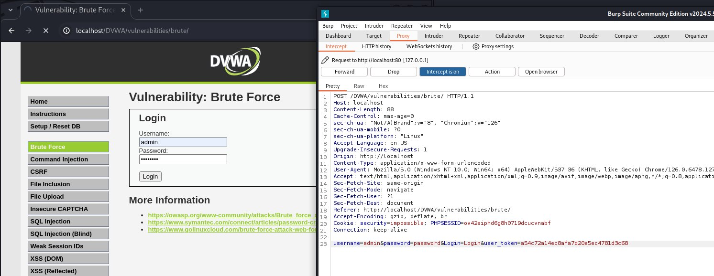{#fig:009 width=70%}

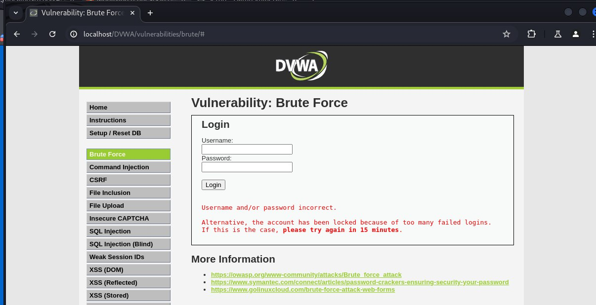{#fig:010 width=70%}

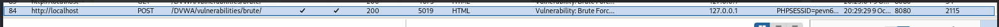{#fig:011 width=70%}

# Выводы

Мы обрели практические навыки использования Burp Suite, осуществив перехват запроса для веб-сервера DVWA и перехватив запрос аутентификации с изменением его данных

# Список литературы{.unnumbered}

::: {#refs}
:::
